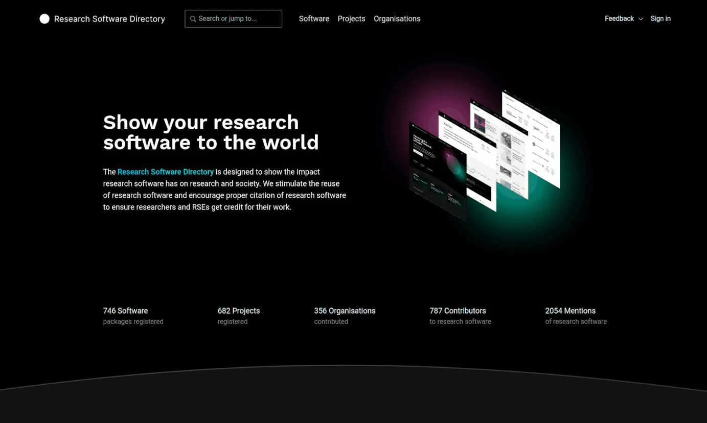
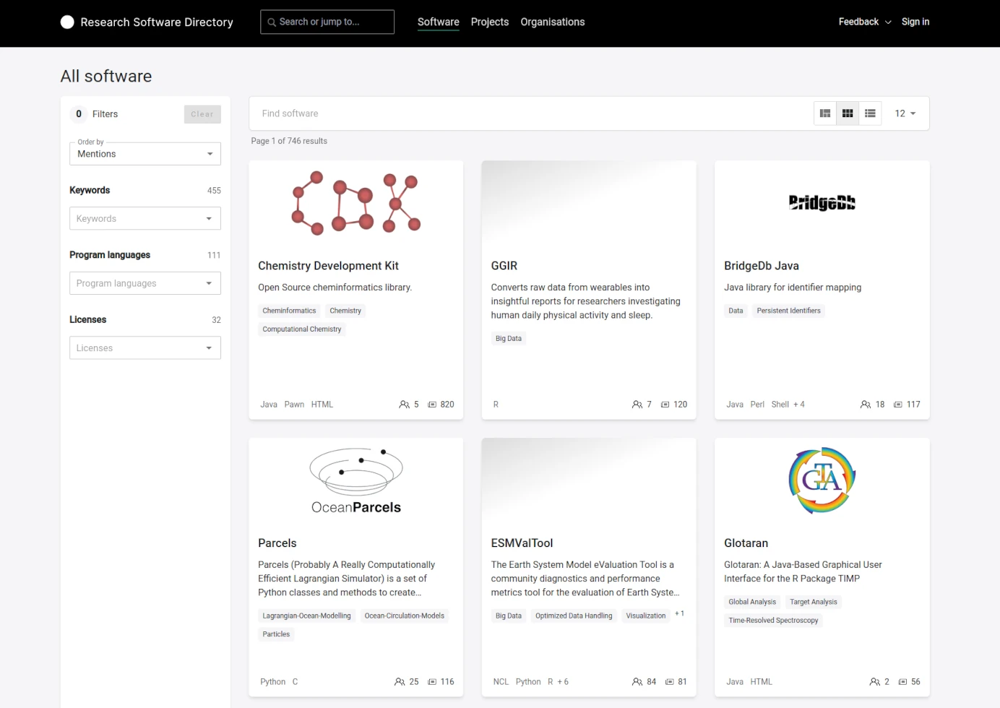
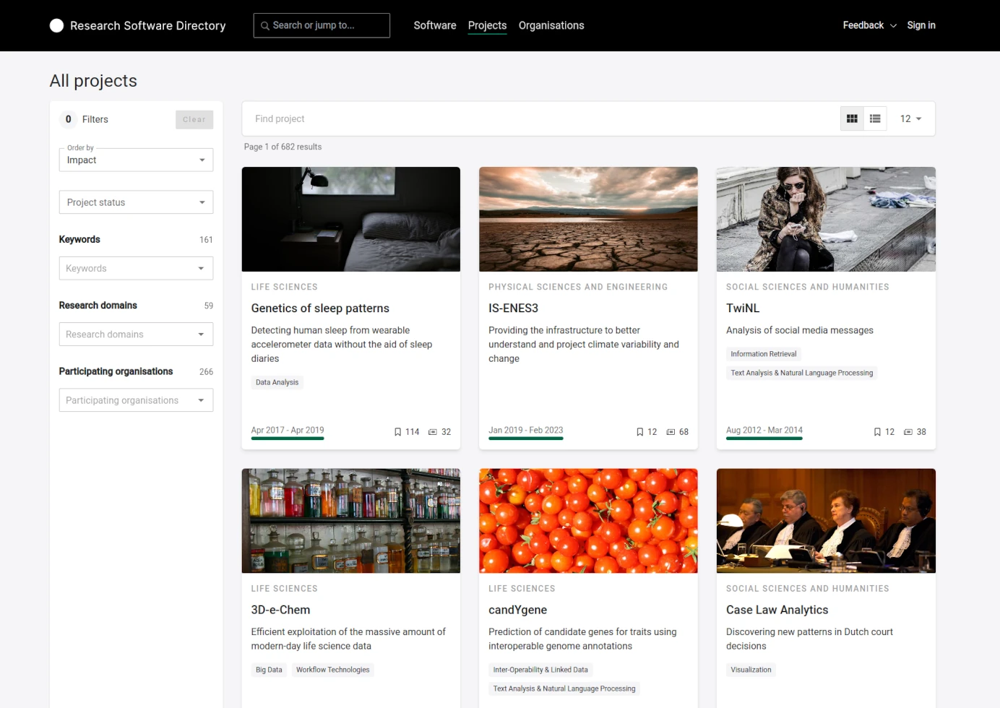
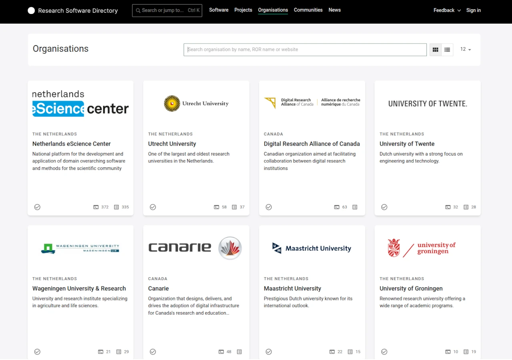
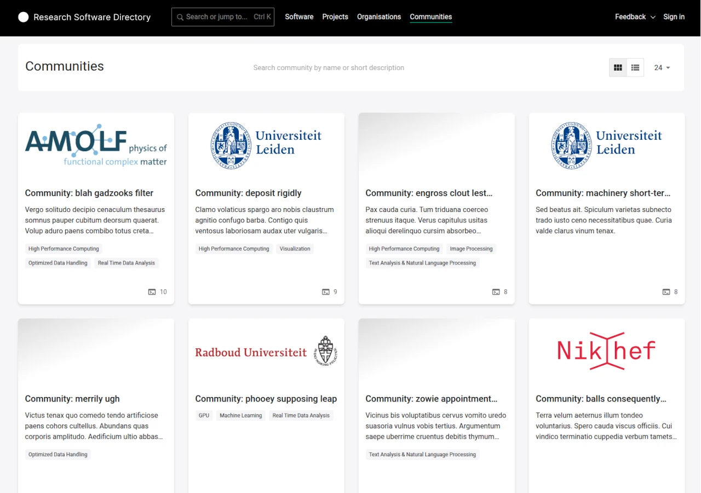

# Navigating the RSD

There are many ways to discover interesting research software on the RSD. The main starting points are:

* The search bar (in the header)
* The software overview (reachable by clicking "Discover Software" or the "Software" link in the header)
* The projects overview (reachable by clicking "Projects" in the header)
* The organizations overview (reachable by clicking "Organizations" in the header)

For more advanced users, we also offer a [REST API](/API/rest-api/), allowing you to use the RSD as a data source for other applications.

## Global search

Using the search bar in the header, you can perform a global search of all data in the RSD by simply providing a search term.
Currently, the search will match the following fields:

* the name of software, projects and organisations
* the slug of software, projects and organisations
* the keywords of software and projects
* the short description of software
* the subtitle of projects

At the moment, we do not yet match on the long descriptions of software, projects and organisations, but we expect to do so in the future.

## Software Overview

The software overview page provides a list of all software in the RSD. For each software, a __card__ is shown with basic information: name, short description, last update,
number of mentions, and number of contributors. To browse and search for software of interest, the _filter and search_ bar can be used.

Simply typing into the search bar will trigger the RSD to search for software containing (part of) the terms you entered. The name, short description and
keywords are included in the search. Entering multiple words into the search bar will be interpreted as an __AND__. Only software containing all search terms will be shown as a result.

By default, 12 software cards are shown per page. This number can be increased if desired using the __Per page__ dropdown menu.

It is also possible to filter the software by keywords, programming languages and the license. Selecting multiple filter values is interpreted as an __AND__. Only software using all of the selected filters will be shown as a result. You can also combine filters with the search term to further reduce the selection.

## Project Overview

The project overview page provides a list of all projects in the RSD. For each project, a __card__ is shown with basic information: name, short description, last update, and if the project is running or completed. To browse and search for projects of interest. The _filter and search_ bar on the page can be used.

Simply typing into the search bar will trigger the RSD to search for projects containing (part of) the terms you entered. The name, short description, keywords, and research domains are included in the search. Entering multiple words into the search bar will be interpreted as an __AND__. Only projects containing all search terms will be shown as a result.

By default, 12 project cards are shown per page. This number can be increased if desired using the __Per page__ dropdown menu.

It is also possible to filter the projects by keywords, research domains and/or participating organisations. Selecting multiple filter values is interpreted as an __AND__. Only software using all of the selected filters will be shown as a result. You can also combine filters with search terms to further reduce the selection.

## Organisation Overview

The organisation overview page provides a list of all organisations listed in the RSD. For each organisation, a __card__ is shown basic information: name, logo, and the number of
software and project pages which this organisation participates in.

For organisations which are a registered member of the RSD, the  checkmark is shown on the card. If you wish to register your organisation, you
can find more information in [How to register an organisation](/users/register-organisation).

To browse and search for organisations of interest, the _search_ bar on the top of the page can be used. Simply typing into the search bar will trigger the RSD to search for organisation whose name contains (part of) the terms you entered. Entering multiple words into the search bar will be interpreted as an __AND__. Only organisations whose name contains all search terms will be shown as a result.

By default, 12 organisation cards are shown per page. This number can be increased if desired using the __Per page__ dropdown menu. The __\<__ and __\>__ icons can be used to move
between pages.

## Communities Overview

The community overview page provides a list of all communities present in the RSD. For each community, a __card__ shows basic information, including the number of software packages. The communities are ordered by the number of related software pages.

You can use search bar at the top of the page to find a specific community by name or description. If you wish to register your own community, please contact the core RSD team on rsd@esciencecenter.nl.
