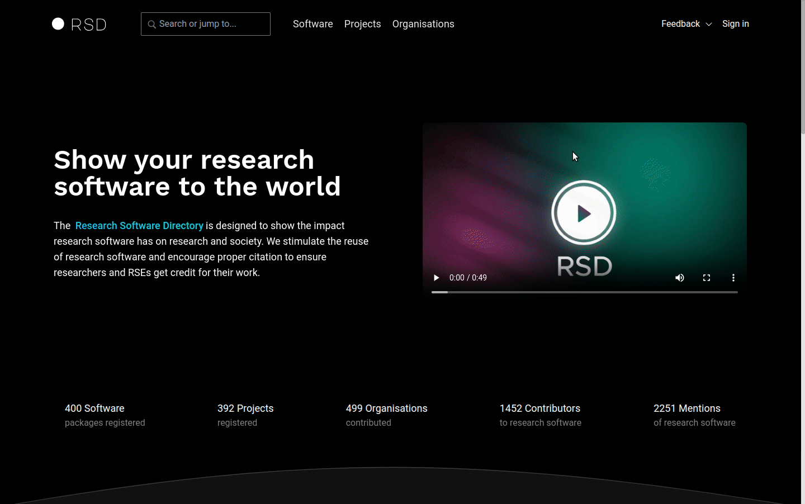
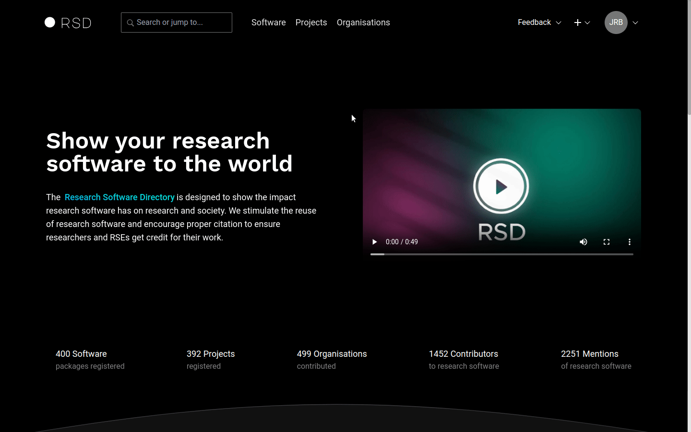

# How to get access

While anyone is free to browse through the content of the RSD, you'll need to be able to sign in before you can add our own content.
Currently, there are two ways to get access:

* You have an [ORCID](https://orcid.org/), and send us a request for access, or
* Your organisation participates in [SURFconext](https://www.surf.nl/en/surfconext-global-access-with-1-set-of-credentials) and has enabled access to the RSD.

If you wish to add your organisation to the RSD or claim an organisation which is already listed, please have a look at how to [Register an organisation](/users/register-organisation).

## Getting access via ORCID

[ORCID](https://orcid.org/) is the Open Research and Contributor ID. It provides a unique, persistent identifier for researchers and is widely used to identify their
contributions to research outputs (such as publications, software, data, etc.). You can use your ORCID account to get access to the RSD. However, since anyone is free
to create an ORCID, we only enable ORCID sign-in on request.

:::tip
Please [contact us](mailto:rsd@esciencecenter.nl) if you wish to use ORCID to sign in to the RSD and provide the following information:

* Your name.
* Your affiliation(s).
* Your ORCID.
* Example links illustrating the content you wish to add.
:::

We will then contact you to arrange access. Once your ORCID sign in is enabled, an RSD account is created automatically the first time you [sign in](/users/getting-access/#how-to-sign-in).

## Getting access via SURFconext

[SURFconext](https://www.surf.nl/en/surfconext-global-access-with-1-set-of-credentials) is an identity provider for Dutch research and education institutions. It can be used by
employees of member organisations to sign in to the RSD using their institute credentials. You can check if your organisation in on the list of [SURFconext
members](https://support.surfconext.nl/stats/idplist.html). Before you can use SURFconext to sign in, your organisation __must enable the RSD service__ in their SURFconext
dashboard.

:::tip
You can check [here](https://dashboard.surfconext.nl/apps/9514/oidc10_rp/about) if your organisation has enabled the RSD service in SURFconext.
:::

If your organisation has not enabled the RSD service yet, please contact your local SURFconext representative, and ask them to contact us via the
[RSD administrators](mailto:rsd@esciencecenter.nl) email. In the meantime you may use the ORCID sign in described above as an alternative.

Once your organisation has enabled the RSD service in SURFconext, you should be able to sign in to the RSD using your institute credentials. An RSD account is created automatically
the first time you [sign in](/users/getting-access/#how-to-sign-in).

## How to sign in

To sign in to the RSD, go to the __"Sign in"__ button in the top right corner of the page and select the identity provider you wish to use. Next, you will be redirected to a login page of the selected identity provider. After providing you credentials you will return to the RSD page you came from.

:::info

* If you sign in to the RSD for the first time, the identity provider may ask you permission to share information with the 
RSD.
* Before editing any item in RSD, you should the accept terms and conditions. You can find these in your personal settings.

:::

## How to sign out

To sign out, you can use the profile button in the top right corner of the page and select __"Logout"__:

