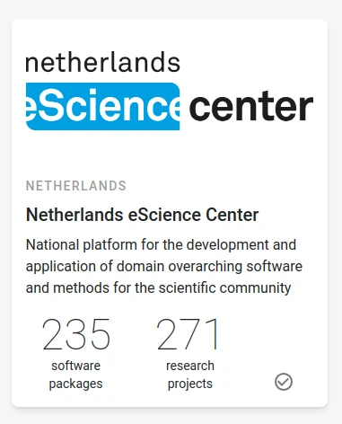

# Register organisation

If you wish to officially add your organisation to the RSD, or claim an organisation which is already listed but not an official member yet, please contact the
[RSD administrators](mailto:rsd@esciencecenter.nl) and clearly provide the following information:

* Your name.
* Which organisation you represent.

We will then contact you to arrange access for your organisation. Once your organisation is registered,
this will be indicated by a verification checkmark on the card of your organisation:

## Which organisations can join the RSD

In the RSD, we interpret the term "organisation" very broadly. Any organisation involved in the development of research software should be able to join the RSD.
Examples of organisations include (but are not limited to):

* Universities
* Research Institutes
* Research Infrastructure Projects
* Virtual Research Organisations and Consortia
* Research Communities
* Startups and companies which maintain or contribute to research software
* etc.
