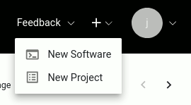
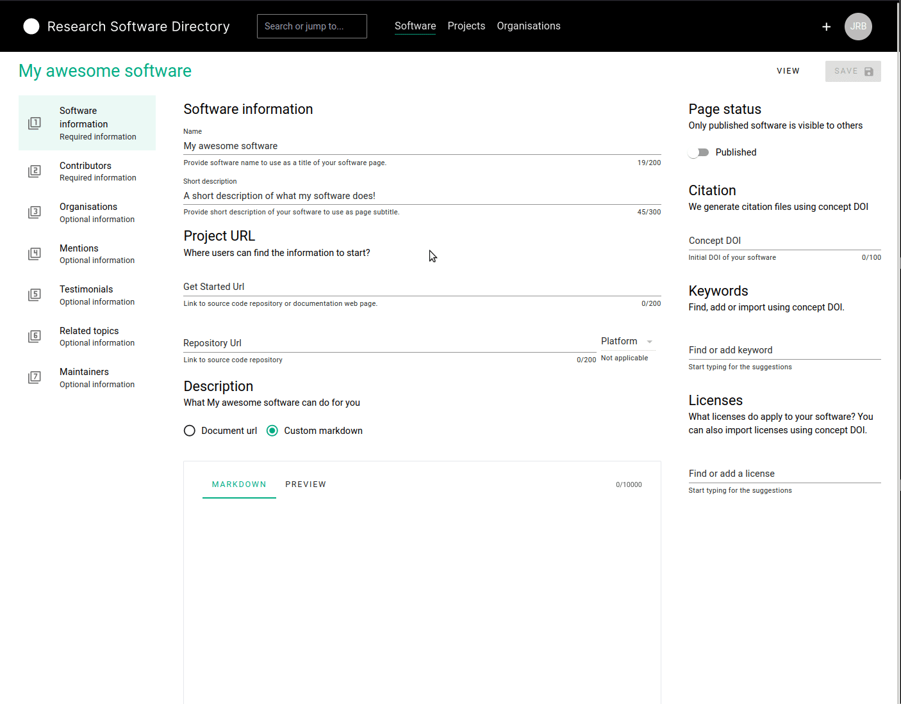
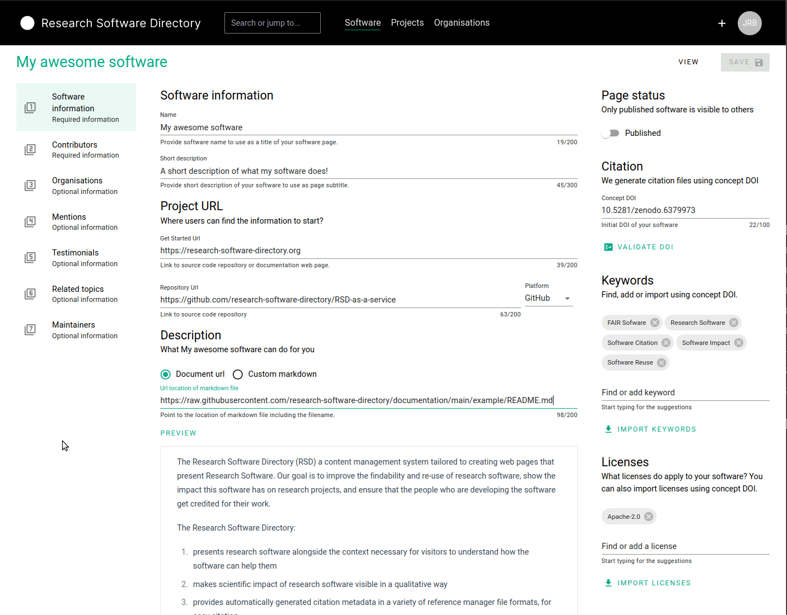
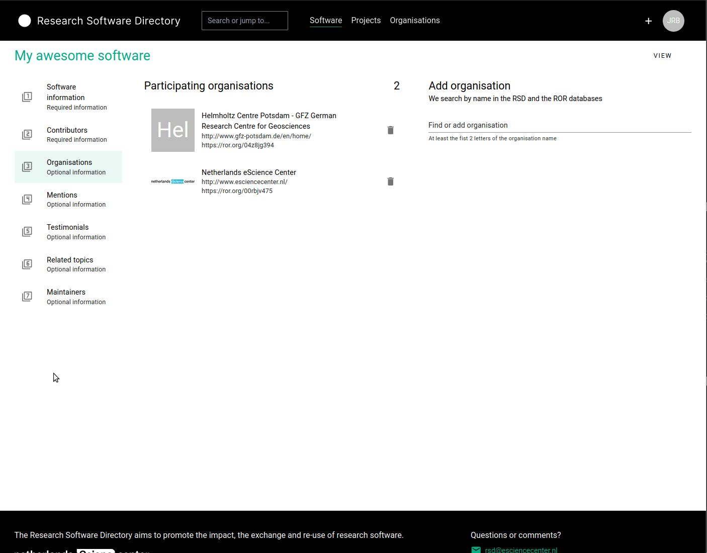
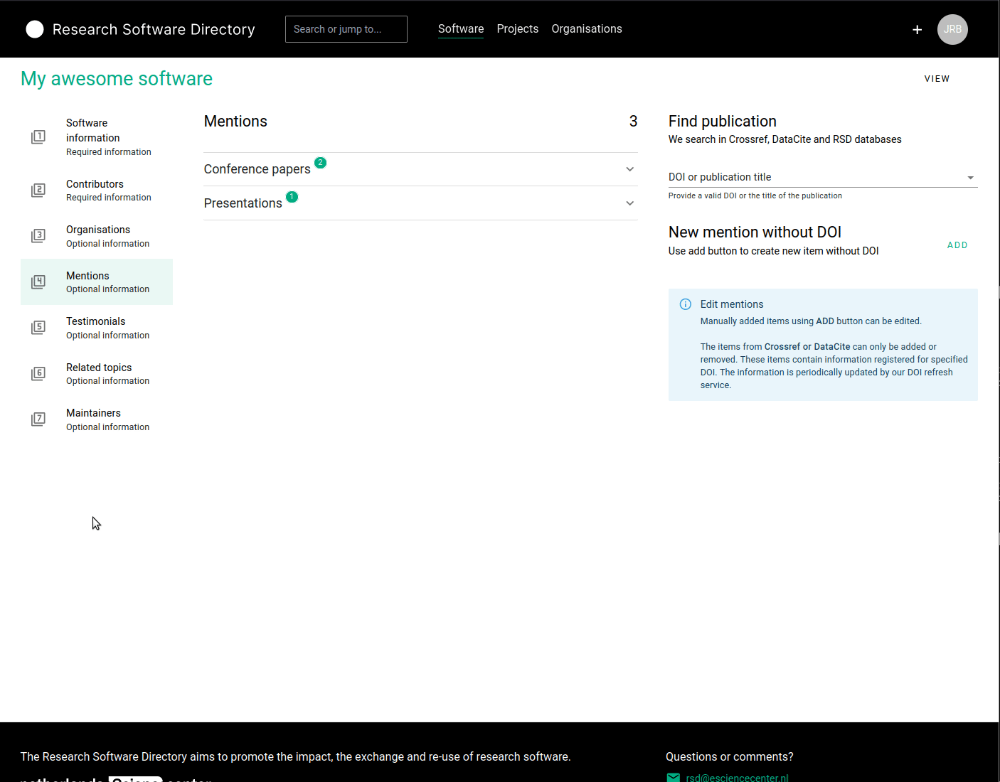
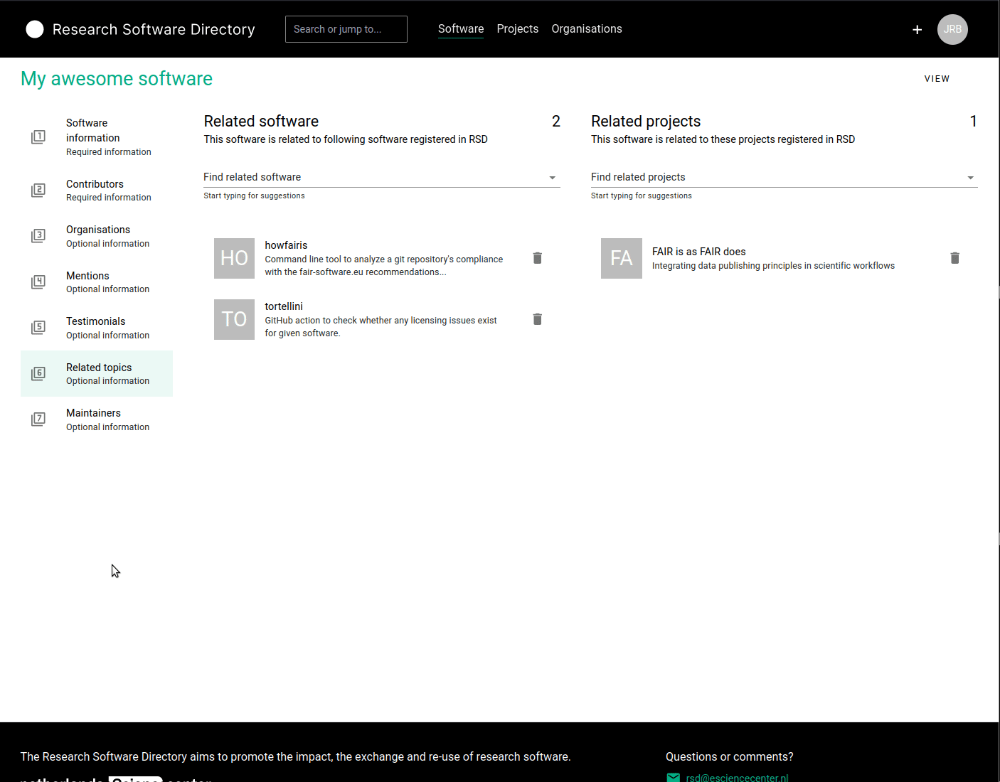

# Adding software

Before you can add software, you will need have access to the RSD. See [How to get access](/users/getting-access) and [Sign in](/users/getting-access#how-to-sign-in).

After signing in, you can use the **"+"** button next to your avatar icon on the top right of the page, and from the drop-down menu select "New Software":

To create a new software page, you must provide a name for your software and a short description of what it does. Once you click "save" the RSD will use this information to
initialize a new empty software page. This software page is not public yet to give you some time to provide additional information.

Next, you can add additional information in the 7 sections explained below.

## Basic information

In this section you can provide the basic information about the software:

- A **Getting started URL** which refers to webpage with more information about the software. This is shown as the "getting started" button on the software page.
- A **Source code repository URL** of the software. This link will show up as a repository icon on the software page and will be used to harvest information about the software development activity, which will be shown as a graph. At the moment we support [GitHub](https://github.com/), [GitLab](https://about.gitlab.com/) and have limited support for [Bitbucket](https://bitbucket.org/product/).
- A more extensive **Description** of the software, which will be shown on the software page. You can use markdown to write this description, or import an existing markdown file from the web.
- A **concept DOI** for the archived releases of the software. This concept DOI will be used to automatically detect new releases of your software, and generate the block with citation information shown on the software page. You can find more information on [concept DOIs at Zenodo](https://help.zenodo.org/faq/).
- A **Logo**, which will be shown on the software page and on the various overview pages.
- **Keywords** describing the software. These will be shown in the sidebar of the software page. If you have provided a concept DOI, the keywords can also be imported from the archive metadata.
- The **License** of the software. This will be shown in the sidebar of the software page. If you have provided a concept DOI, the license can also be imported from the archive metadata.

## Contributors

In this section, you can provide more information on who contributed to the software. This section can be used to list the developers, designers, community managers, etc. If you
have provided a **concept DOI** in the previous section, you can import the contributors from the DOI metadata by clicking the "import contributors" button. Alternatively /
additionally you can use the search bar underneath "Add contributor" to search for people already registered in the RSD or [ORCID](https://orcid.org) database. If needed, you can
add a role and affiliation to the contributor, and select one contributor as a "contact person" for the software.

The contributors you add will show up in the contributors section of the software page.

## Organisations

In this section, you can list which organisations contributed to the development of the software. You can use the search bar underneath "Add organisation" to search for
organisations already registered in the RSD or in the [ROR](https://ROR.org) database.

## Mentions

This section allows you to add mentions to your software page. You can use this to list publications, presentations, videos, blogs, etc. that prominently feature your software, or the results produced by your software.
To add a mention, you can use the search bar below "Find publication" to search for a DOI or publication title in the RSD, [Crossref](https://www.crossref.org/) or [DataCite](https://datacite.org/). All the relevant data about the publication will be retrieved automatically. For publications without a DOI (typically blogs or webpages), it is also possible to manually add a mention.

### Bulk import

It is also possible to bulk add mentions, that have a DOI, to the page. On the right hand side of the page, click on the *Import* button. On the popup, you can add one DOI per line, with a maximum of 50. After clicking on the *Next* button, we will fetch the data, which can take a moment. When that is done, you will see an overview of the data we fetched, including possible errors, where you can check the data and possibly disable some of the mentions. You can then add the mentions by clicking on the *Import* button.

## Testimonials

This section allows user testimonials to be added to the software page. A testimonial consist of a quote and a source.

## Package managers

If your software is available through a package manager like Anaconda, PyPi or Docker Hub, you can add links to those here. We will use these to scrape some data like download count and the number of packages that depend on your software. We do not show this info on the public view of your page, as we're still in the process of figuring out how much data we can harvest and how to present this in the best way. It would therefore be very helpful if you add this information to your software page.

We currently support the following package managers:

- [Anaconda](https://anaconda.org/)
- [Cran](https://cran.r-project.org/web/packages/index.html)
- [Docker Hub](https://hub.docker.com/search?q=)
- [Maven](https://mvnrepository.com/)
- [npm](https://www.npmjs.com/)
- [PyPI](https://pypi.org/)

If your package manager is not listed above, you can still add it, but we will categorise it as *other* and cannot scrape it yet. You can [open an GitHub issue](https://github.com/research-software-directory/RSD-as-a-service/issues) (please check for existing issues first) or contact us if you want us to support an additional package manager.

## Related software

The related software sections can be used to link related software pages in the RSD to this software page. Items can be added by simply typing (part) of the name in the search bar and selecting the desired item from the search result list.

## Related projects

The related projects sections can be used to link related project pages in the RSD to this software page. Items can be added by simply typing (part) of the name in the search bar and selecting the desired item from the search result list.

## Maintainers

Here, you can see all the people who can maintain this software page. You can also create invitation links to send to people you want to give maintainer access and see and delete all unused invitations.

## The finished page

Once you are satisfied with the data you have entered for the different sections, you can publish the software page to make it publicly available. Don't hesitate to update and
extend the page later!

