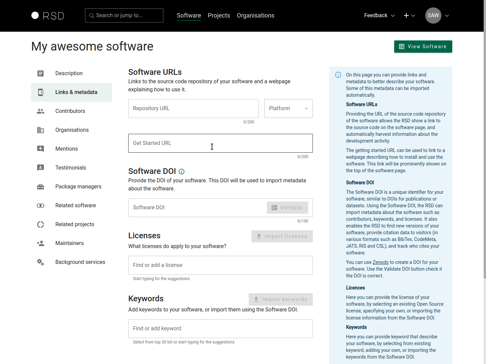
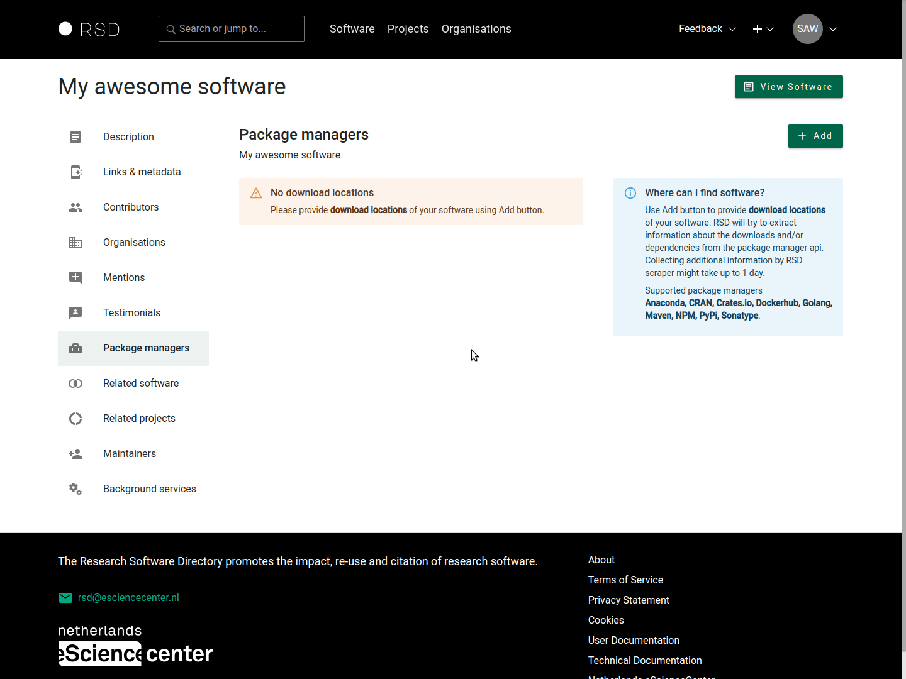

# Adding software

:::warning
Before you can add software, you will need to get access to the RSD. See [How to get access](/users/getting-access) and [Sign in](/users/getting-access#how-to-sign-in).
:::

After signing in, you can use the **"+"** button next to your avatar icon on the top right of the page. Select "New Software" from the drop-down menu.

To create a new software page provide a name and a short description (optional) of what your software does. Once you click "Save" the RSD will use this information to create a new software page. Next, you can add additional information using the sections explained below.


## Description

In this section, you can provide the basic information about the software, like a **description** of the software, which will be shown on the software page. You can use [custom Markdown](#custom-markdown) to write the description or [link to existing Markdown](#markdown-url) page on the web.

### Custom Markdown

The custom Markdown supports basic Markdown features: titles, bullet points, code area, simple table, task list, links and the images. The example below demonstrates widely used Markdown features in RSD.

```markdown
<!--This section starts with What {software name} can do for you-->

Good practice at eScience Center was to start this section with a number of bullets that answer the question

- Main reason number 1 why this software is useful to someone else
- Main reason number 2
- Main reason number 3
- Main reason ...( 3 to 7 points would be most useful in my opinion)

## Subtitle

Another section with subtitle

## Code area

Use `three backticks` to create a code area

`bash
This example is code area
`

## Simple table

| column 1       | column 2 | column 3 |
| -------------- | -------- | -------- |
| 123242         | 234234   | 3        |
| some text here | 34       | x=23     |

## Task list

- [x] Do this first
- [ ] Then this
- [ ] And this at last

## Links

[This is a link to Google](https://www.google.nl/)

## Images

You need to use the full URL of the image and the image needs to send CORS headers, otherwise the image will not be loaded


```

### Markdown URL

You can link to a remote Markdown file which will be dynamically loaded by the RSD. An often used approach is to link to a readme file on the GitHub repository. In this case you need to link to the `raw` version of the readme file. For example, to link to the readme file of the RSD repository, we used the link https://raw.githubusercontent.com/research-software-directory/RSD-as-a-service/main/README.md. **Note that the URL domain is different** `https://raw.githubusercontent.com/` from the default GitHub domain (https://github.com).

:::warning
When using a Markdown URL to point to a remote Markdown file all links used in the Markdown document, like **images**, need to use the **full URL** (e.g. use `https://user-images.githubusercontent.com/4195550/136156498-736f915f-7623-43d2-8678-f30b06563a38.png`, not `/4195550/136156498-736f915f-7623-43d2-8678-f30b06563a38.png`). This is required, because the Markdown content is loaded into the RSD website.
:::

### Logo

The software logo is shown on the software page and in the software card (see example below). **You can upload an image up to 2MB of size**. Widely used image formats like JPG, JPEG, PNG, SVG etc. are supported. Use the **SVG** format, if possible, because it scales better than other formats.


## Links & metadata



### Software URLs

- A **Source code repository URL** of the software. This link will show up as a repository icon on the software page and will be used to harvest information about the software development activity, which will be shown as a graph. At the moment we support [GitHub](https://github.com/), [GitLab](https://about.gitlab.com/) and have limited support for [Bitbucket](https://bitbucket.org/product/). The platform is automatically detected from the http domain, but can be changed manually.

  The RSD supports URLs starting with https that point to the repository website, or to the actual git repository, for example:

  - `https://github.com/research-software-directory/RSD-as-a-service` (website)
  - `https://github.com/research-software-directory/RSD-as-a-service.git` (git repository)

- A **Getting started URL** which refers to webpage with more information about the software. This is shown as the "Get started" button on the software page.

### Software DOI

The software DOI will be used to automatically detect new releases of your software, and generate the block with citation information shown on the software page. You can find more information on [DOI versioning at Zenodo](https://help.zenodo.org/faq/#versioning).

After providing a DOI, use the "Validate" button to confirm that provided DOI is valid "Concept/Software" DOI. If the provided DOI is a version DOI, and RSD is able to find the concept DOI, it will update the DOI and notify you about the change.

:::tip
After providing a valid software DOI, you will have the option to import keywords, software license and contributors provided in the DOI metadata.
:::

### License

The **License** of the software. This will be shown in the sidebar of the software page. If you have provided a software DOI you can import the license info from DOI metadata.

:::tip
When you start typing the license you will get a list of valid open source licenses pulled from the [SPDX repository](https://github.com/spdx/license-list-data).
:::

### Keywords

The keywords describing your software. These will be shown in the sidebar of the software page. Users can filter all software entries by keywords. If you provided a software DOI and have keywords defined in this DOI, you can import them using the "Import keywords" button.

:::tip
When you start typing the keyword you will see a list of suggestions based on the keywords already present in RSD.
:::

### Categories

**Categories** are a set of curated keywords defined by RSD admins. If they exist, you can add them to (and delete them from) your software page here.

## Contributors

In this section, you can provide more information on who contributed to the software. This section can be used to list the developers, designers, community managers, etc.

You can use the search bar underneath "Add contributor" to search for people already registered in the RSD or [ORCID](https://orcid.org) database. If needed, you can add a role and an affiliation to the contributor, and select one contributor as a "contact person" for the software.

The contributors you add will show up in the contributors section of the software page.

:::tip
If you have provided a **Software DOI** in the previous section, you can import the contributors from the DOI metadata by clicking the "Import contributors" button (see animation).
:::


### Contact person

**One of the contributors** can be defined as contact person. The contact person will appear in a separate card and the email button will be displayed if an email address is provided.

:::warning

- Only one person can be shown in the card as a contact person.
- Please ensure the contact person has a valid email address.

:::

## Participating organisations

In this section, you can list which organisations contributed to the development of the software. You can use the search bar underneath "Add organisation" to search for
organisations already registered in the RSD or in the [ROR](https://ROR.org) database.


### Organisation categories

If the maintainers of the organisation have created custom categories, you will see **an additional modal asking you to select organisation specific categories that apply to your software**.

:::tip

- Custom organisation categories will be shown on the software page below the logo and before the keywords. Use the "View Software" button to see how custom organisation categories are displayed on the software page.
- You can change the custom organisation categories using the categories button.

:::

## Mentions

This section allows you to add mentions to your software page. You can use this to list reference papers, publications, presentations, videos, blogs, etc. that prominently feature your software, or the results produced by your software.


### Reference papers

:::info
A reference paper is an article or artifact with a DOI that primarily describes your software, such as analysing its implementation efficiency or detailing new features.

If other researchers use your software and mention it in their studies, please list these papers under [Related output](#related-output).
:::

Use the _Search_ box on the right hand side to find papers by DOI, OpenAlex ID or title. All the relevant data about the publication will be retrieved automatically. A background scraper will use [OpenAlex](https://openalex.org/) to collect all citations of reference papers that have a DOI or an OpenAlex ID.

### Citations

These are the citations of the reference papers that the RSD scraper was able to find on [OpenAlex](https://openalex.org/). It can take a few minutes before the citations are harvested.

:::warning
You cannot edit the content of this section. All entries are automatically harvested and generated by the RSD scraper. The mentions found are displayed in the mentions section of the software page.
:::

### Related output

Here you can add all additional related output. Use search to find papers or other publications by DOI, OpenAlex ID or title. It is also possible to bulk add mentions, that have a DOI (use the _Import_ button). On the popup, you can add one DOI per line, with a maximum of 50. After clicking on the _Next_ button, we will fetch the data, which can take a moment. When that is done, you will see an overview of the data we fetched, including possible errors, where you can check the data and possibly disable some of the mentions.

## Testimonials

This section allows user testimonials to be added to the software page. A testimonial consist of a quote and a source. The source is a free text field. In the source field, you can provide the name, date, location or anything else in any order and format you wish.


## Package managers

If your software is available through a package manager like Anaconda, PyPi or Docker Hub, you can add links to those here. We will use these to scrape some data like download count and the number of packages that depend on your software. We do not show this info on the public view of your page, as we're still in the process of figuring out how much data we can harvest and how to present this in the best way. It would therefore be very helpful if you add this information to your software page.

We currently support the following package managers: [Anaconda](https://anaconda.org/), [Cran](https://cran.r-project.org/web/packages/index.html), [Chocolatey](https://community.chocolatey.org), [Debian](https://packages.debian.org), [Docker Hub](https://hub.docker.com/search?q=), [GitHub](https://github.com), [Gitlab](https://gitlab.com), [Go](https://pkg.go.dev), [Maven](https://mvnrepository.com/), [npm](https://www.npmjs.com/), [PyPI](https://pypi.org/), [Rust](https://crates.io), [Sonatype](https://central.sonatype.com/), [Snapcraft](https://snapcraft.io).

If your package manager is not listed above, you can still add it, but we will categorise it as _other_ and cannot scrape it yet. You can [open an GitHub issue](https://github.com/research-software-directory/RSD-as-a-service/issues) (please check for existing issues first) or contact us if you want us to support an additional package manager.



## Communities

:::tip
If communities are enabled for this RSD instance, you will be able to see this section.
:::

In this section, you can see the communities this software page is affiliated with and its status (accepted, pending or rejected). Only if the status is accepted, the community will be shown on the software page. The RSD doesn't have an internal messaging system yes, so if you want to know more about e.g. why your software is rejected, you should contact someone from the community directly.

You can also search for new communities to become a part of, just type the name in the search bar to start searching.

When you join a community, this community may ask you to select certain community-specific keywords that describe you software (we call these **categories** in the RSD). You will be prompted to assign categories to your software page before the request to become part of the community is sent (if a community doesn't have categories, the request is sent automatically).

After selecting the relevant categories for your software, click **Save** to complete the join request. You will now see the community listed with your software. The community will be set to **Pending** until a community maintainer accepts or rejects your join request.

You can still edit the categories of a community that assigned to your software page afterwards, just click on the categories icon.
If you leave a community, any associated categories of that community will automatically be deleted from your software page.


## Related software

The related software sections can be used to link related software pages in the RSD to this software page. Items can be added by simply typing (part) of the name in the search bar and selecting the desired item from the search result list.

## Related projects

The related projects sections can be used to link related project pages in the RSD to this software page. Items can be added by simply typing (part) of the name in the search bar and selecting the desired item from the search result list.

## Maintainers

Here, you can see all the people who can maintain this software page. You can also create invitation links to send to people you want to give maintainer access and see and delete all unused invitations.

:::info

- Each invitation link can be used only once.
- Each invitation expires after 31 day and can be removed before the expiry date as well.

:::

## Background services

Here you can find the information about the background services that RSD offers and their last status.

You can clear the data that the scrapers collected by clicking on the delete icons next to the individual services. This is useful for example if you changed your default branch or rebased your git commit history.

:::tip
Please check this section from time to time to confirm that information you provided is correct and that RSD background services are able to use provided information in the proper way.
:::

## The finished page

Once you are satisfied with the data you have entered for the different sections, you can publish the software page to make it publicly available. Don't hesitate to update and extend the page later!


