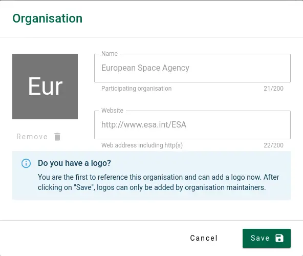

# Adding a project

:::warning
Before you can add projects, you will need to get access to the RSD. See [How to get access](/users/getting-access) and [Sign in](/users/getting-access#how-to-sign-in).
:::

After signing in, use the **"+"** button next to your avatar icon on the top right of the page, and select "New Project". Before the project page is created, you must provide a **Title** and **Subtitle** for your project:

The RSD will automatically generate a _slug_ for your project based on the project name you have provided. This slug will become part of the URL on which your project page can be found.
There is a small chance the generated slug is already in use by another project. If this is the case, an error will be shown, and you will need to change the slug manually to resolve this conflict.

Once you click **"save"**, the RSD will initialize a new empty project page. This page will not be public yet to give you some time to provide additional information. Next, you can add additional information in the edit sections explained below.

:::warning
After you save the project page the slug can no longer be changed!
Only administrators can change the slug. You can change the title or subtitle of the project later using "Project details" section.
:::

## Project details

On this page, you can add and change the basic information about the project. This includes:

- The **title** of the project
- A **subtitle** (which briefly explains the topic).
- An **image** illustrating the topic or goal of the project
- A **description** of the project written in Markdown ([see the documentation on the software description](/documentation/users/adding-software/#custom-markdown)).

In addition, the sidebar on the right shows:

- The **publication status**
- A **start date** and **end date**
- A **Grant ID**
- The **funding organisation(s)** as listed in the RSD or the [ROR database](https://ror.org)
- A list of relevant **Project links** (such as a project web page, GitHub organisation, etc.)
- The **Research domain(s)** of this project (as defined by the [ERC](https://erc.europa.eu/news/new-erc-panel-structure-2021-and-2022))
- **Keywords** for this project

While entering this information, any changes you make are saved immediately. You can view the resulting page by clicking on **View Project** in the top right corner. To get back to the editing view click on the "Edit project" button in the top right. The **Published** slider can be used to make the page public once you are satisfied with the result.

:::tip
Choose your **Title**, **Subtitle**, **Keywords** and **Research domains** wisely, as they are used by visitors of the RSD for searching and filtering content!
:::

## Project Team

On this page, you can add team members to the project. Using the search bar on the left, you can search for persons registered in the RSD and [ORCID](https://orcid.org) databases
using their name or ORCID.

To add a team member, select the person from the drop-down list of search results, or select "Add ...." to manually add a person if no information is found in the RSD or ORCID. Next, a pop-up appears with the information available on this team member.

You can correct the available information and add any missing fields before adding this person to the team. The information stored about each team member is specific to this
project. Therefore, you can safely change information about this person without having an effect on any other project the person is involved in.

:::danger
When manually adding team members or adding images or email addresses of persons, please ensure you have **permission** to share this information!
:::

## Participating organisations

On this page, you can add participating organisations to the project. Using the search bar on the left, you can search for organisations listed in the RSD and [ROR](https://ror.org)
databases using their name or ROR identifier. To add a participating organisation, select the organisation from the drop-down list of search results, or select "Add ...." to
manually add an organisation if no information is found in the RSD or ROR.

Next, a pop-up appears with the information available on this organisation:

The information on organisations found in the RSD or ROR database are (mostly) **read-only**. When adding a new organisation from ROR, you can only add a logo for this organisation.
All other information is retrieved automatically.

:::warning
Regular users cannot update an organisation after adding it to the RSD. Only the organisation maintainer (for registered organisations) or the RSD administrators can update this
information. Please [contact us](mailto:rsd@esciencecenter.nl) if you need to update organisation information.
:::

### Organisation categories

If the maintainers of the organisation have created custom categories, you will see **an additional modal asking you to select organisation specific categories that apply to your project**.

:::tip

- Custom organisation categories will be shown on the project page below the keywords. Use the "View Project" button to see how custom organisation categories are displayed on your project page.
- You can change the custom organisation categories using the categories button.

:::

## Mentions

In this section, you can add mentions to your project. These entries may consist of other research outputs such as publications, dataset, book sections, blogs, etc. Where **Output** typically consists of research output being produced by the project team itself, **Impact** is generally triggered by events outside the project, such as re-use of results in other projects, publications, or society, items in the media, etc.

### Output

Here you can add output that was produced by the project itself, such as papers, books, articles, software, datasets, videos, blogs, etc. The RSD will periodically look for citations of this output using OpenAlex and add them to the citations list on this page.

#### Add output

To add an item, the search bar on the left can be used to search the RSD, [Crossref](https://www.crossref.org), [DataCite](https://datacite.org) and [OpenAlex](https://openalex.org/) databases using the **Title**, **DOI** or **OpenAlex ID** of the research output. An item can be added by selecting it from the list of the search results. The RSD will automatically classify the item based on the available metadata.

#### Import output

You can import up to 50 publications by providing a list of DOIs, one per line.

#### Create manually

If the output has no DOI you can create new mention item manually. Each manually added item should at least have a **Title**, **Type** and **URL**. All other fields are optional. The **Note** field can be used to add a note to this item, and will not be shown on the project page.

:::warning
Please check if the information is complete and correct. A manual item cannot be edited after it has been saved!
You can, however, delete an item and create a new one.
:::

### Citations

Here, we list all the citations of your output (that has a DOI or OpenAlex ID) that the RSD was able to find automatically on OpenAlex. On the project page, these citations are shown in the impact section together with the items you added manually.

:::warning
You cannot edit the content of this section. All entries are automatically harvested and generated by the RSD scraper. The publications found are displayed in the impact section of the project page.
:::

### Impact

Here you can add mentions of your project that cannot be found automatically by the RSD. These can be papers by others re-using your project results, press articles or videos highlighting the project, policy documents, etc.

#### Search publication

To add an item, the search bar on the left can be used to search the RSD, [Crossref](https://www.crossref.org), [DataCite](https://datacite.org) and [OpenAlex](https://openalex.org/) databases using the **Title**, **DOI** or **OpenAlex ID** of the research impact item. An item can be added by selecting it from the list of search results. The RSD will automatically classify the item based on the available metadata.

#### Import publication

You can import up to 50 publications by providing a list of DOIs, one per line.

#### Create impact item

If the publication has no DOI you can create a new item manually. Each manually added item should at least have a **Title**, **Type** and **URL**. All other fields are optional. The **Note** field can be used to add a note to this item, and will not be shown on the project page.

:::warning
Please check if the information is complete and correct. A manual item cannot be edited after it has been saved! You can, however, delete an item and create a new one.
:::

## Testimonials

This section allows user testimonials to be added to the project page. A testimonial consist of a quote and a source. The source is a free text field. In the source field, you can provide the name, date, location or anything else in any order and format you wish.

## Related projects

Here you can link related project pages in the RSD to this project page. Items can be added by simply typing (part) of the name in the search and selecting the desired item from the search result list.

## Related software

This page is similar to related projects page. Here you can link related software pages in the RSD to this project. Items can be added by simply typing (part) of the software name in the search and selecting the desired item from the result list.

## Maintainers

Here, you can see all the people who can maintain this project page. You can also create invitation links to send to people you want to give maintainer access and see and delete all unused invitations.

:::info

- Each invitation link can be used only once.
- Each invitation expires after 31 day and can be removed before the expiry date as well.

:::

## Publish project page

Once you are satisfied with the information you have entered for each of the sections, you can publish the project page. To do so, use the **"Published"** slider on the information page and use the **"View Project"** to admire the result. Don't hesitate to update and extend the page later!

:::tip
You can find all projects you maintain in the "My projects" section under your profile menu.
:::

