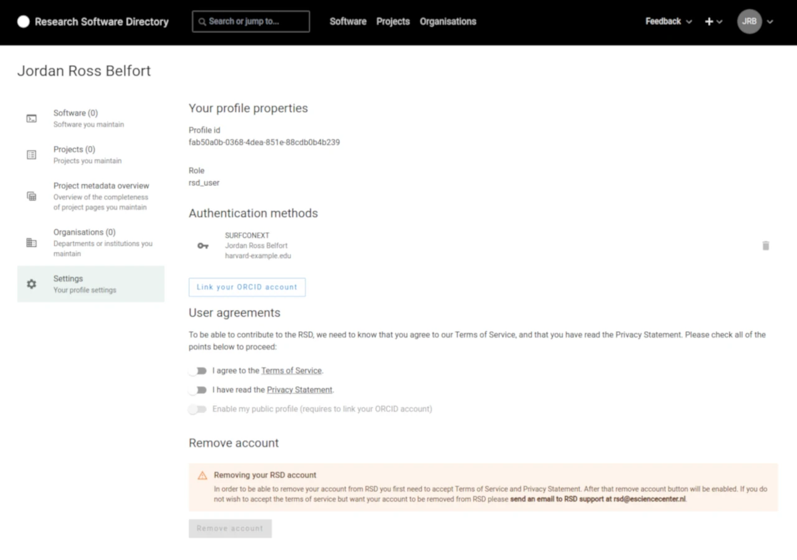

# User settings

You can access user settings via user menu at the top right side of the screen.

## My software

This section lists all software where you are one of the maintainers.

:::tip
It is possible to list all software where you are mentioned as contributor by linking your ORCID account and enabling your [public profile](#public-profile).
:::

## My projects

This section lists all projects where you are one of the maintainers.

:::tip
It is possible to list all projects where you are mentioned as team member by linking your ORCID account and enabling your [public profile](#public-profile).
:::

## My organisations

This section list all organisations where you are one of the maintainers.

## My communities

This section list all communities where you are one of the maintainers.
If the community module is not enabled at the RSD instance this section is omitted.

## User agreements

To be able to contribute to the RSD, we need to know that you agree to our Terms of Service, and that you have read the Privacy Statement.

## Public profile

By enabling public profile you are giving permission to RSD users to:

- include your profile in the search for software contributor or project team member.
- include a link to your public profile page on the software or project pages.

The benefit of public profile is that you have an overview of all software and project entries where you are mentioned as contributor or team member.

:::tip
If you have ORCID you can link your ORCID account to RSD. There are two benefits of linking ORCID

- You can login to RSD using your ORCID credentials too
- Your public profile will include all software and project entries that mention you by your ORCID

:::

