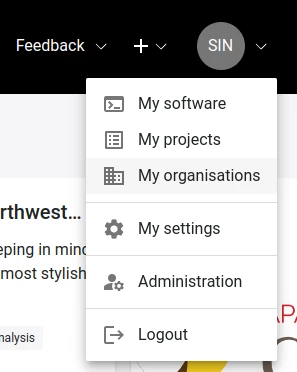
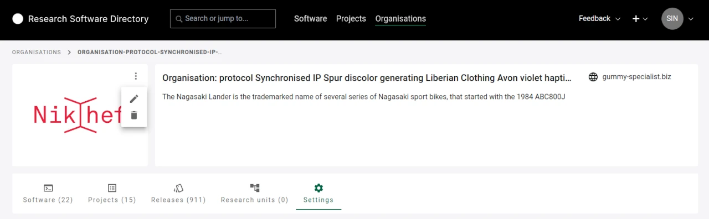
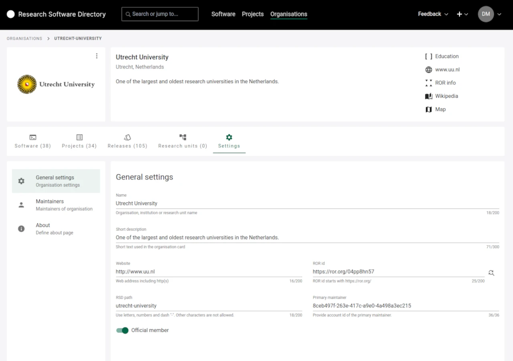
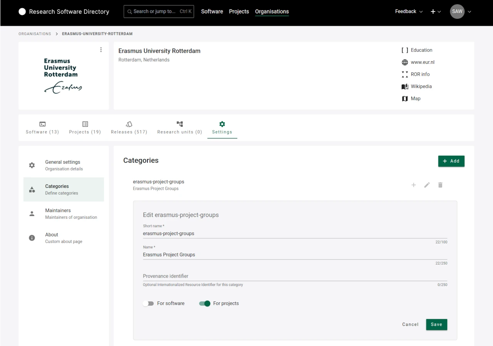
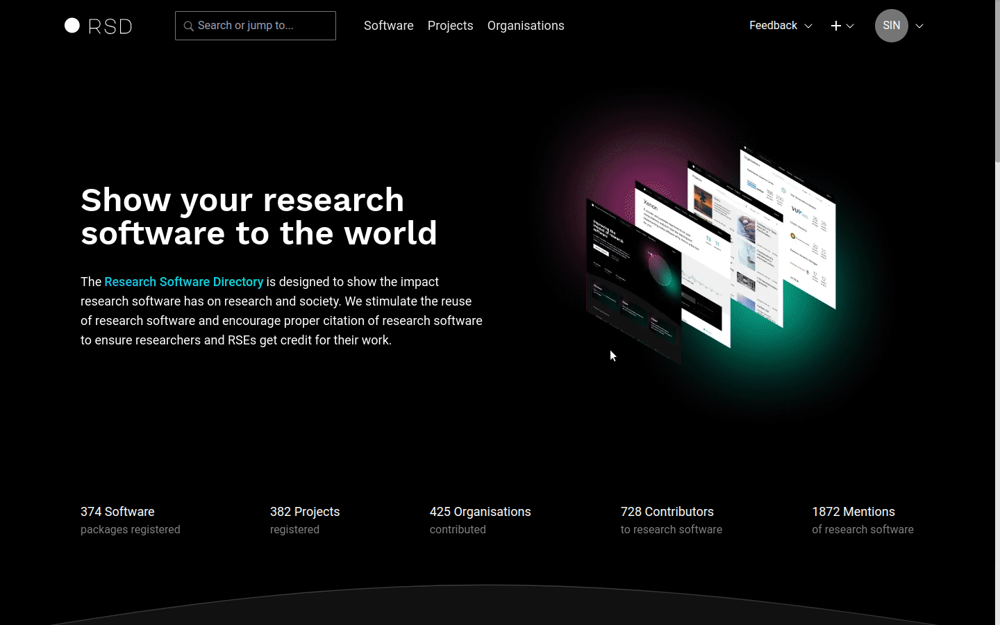
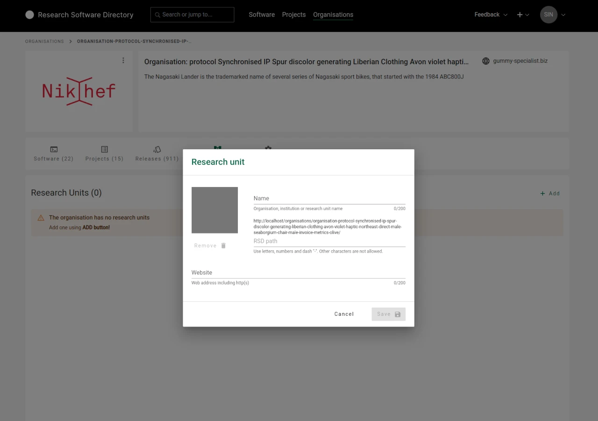

# Maintaining an organisation

Organisations have the opportunity to maintain their representation within the RSD. In order to achieve this, official representatives of the organisation can take on the role of maintainers of their organisation.

## How to claim an organisation?

If you would like to claim an organisation, please have a look at [Register or claim an organisation](/users/register-organisation/).

## What can organisation maintainers do?

The RSD distinguishes between **primary** and **invited maintainers**.
Here is an overview of what each of them can do:

|                                         | Primary maintainer | Invited maintainer |
| --------------------------------------- | :----------------: | :----------------: |
| Edit About section                      |         x          |         x          |
| Upload/delete logo                      |         x          |         x          |
| Edit organisation metadata              |         x          |         x          |
| Reject affiliations (software/project)  |         x          |         x          |
| Pin/unpin software/projects             |         x          |         x          |
| Invite maintainers                      |         x          |         x          |
| Remove maintainers (not primary)        |         x          |         x          |
| Create and edit organisation categories |         x          |         x          |
| Add new research units                  |         x          |                    |
| Remove/change primary maintainer \*     |                    |                    |
| Change organisation URL path \*         |                    |                    |
| Set parent organisation \*              |                    |                    |
| Set as official member \*               |                    |                    |

(\*) These actions can only be performed by administrators (see [Administration section](/rsd-instance/administration/#edit-organisation)). If necessary, contact us via [rsd@esciencecenter.nl](mailto:rsd@esciencecenter.nl).

## My organisations

To see a list of organisations you are a maintainer of use **My organisations** option in your **profile menu**.

## Edit logo

You can edit the logo of your organisation

You can upload a new logo or remove it.
The RSD supports common image formats, e.g. JPG, PNG or SVG.

:::tip
If possible, please upload an **SVG** version of your organisation's logo for optimal visual presentation within the RSD.
:::

## Settings

The organisation settings has the following sections: General settings, Categories, Maintainers and About page.

### General settings

Under **General settings** you can edit:

- Name: displayed in the organisation card and in the header of the organisation page
- Short description: displayed in the organisation card and in the header of the organisation page
- Website: displayed in the header of the organisation page
- ROR id: displayed in the header of the organisation page. It enables RSD to extract additional information from ROR about the organisation

### Categories

Each RSD organisation can define a set of custom categories to be assigned to software and/or projects. When a software/project maintainer adds this RSD organisation to their page, an additional modal is shown to software/project maintainer to assign specific organisation categories to the software/project. These organisation specific categories are shown on the software/project page.

### Manage maintainers

As a maintainer, you can invite or remove other maintainers from your organisation.

:::warning
The **primary maintainer** of an organisation is set by RSD administrators. If you want to change the primary maintainer, contact us via [rsd@esciencecenter.nl](mailto:rsd@esciencecenter.nl).
:::

To invite new maintainers, click on **"Generate invite link"**. A link will be generated. You can either copy this link or click on "Email this invite" to open your mail program with a pre-formulated email.

:::info

- Each invitation link can be used only once.
- Each invitation expires after 31 day and can be removed before the expiry date as well.

:::

### About page

In the **"About"** section, relevant information about your organisation can be added in a free text form.
To edit the content of the section, please navigate to **"Settings"** and scroll down to the **"About"** section.
The text can be formatted using [Markdown syntax](https://www.markdownguide.org/basic-syntax/).

:::tip
If there is no content for the About page, the page will not be shown.
:::

## Pin software or project

To pin specific software or project to the start of the respective list, click on the three dots in the upper right corner of a software or project card and click on **Pin software** / **Pin project**. It will then be shown at the beginning of the list. If you no longer want to pin a software or project, click on the dots in the software card and click **Unpin software** / **Unpin project**.

:::tip
The "Pinned" order is the default order applied when visiting organisation page.
:::

## Deny affiliations

An organisation maintainer can deny affiliations with software or project. To do this, open the context menu of the respective software or project, and click on **Block affiliation**.

:::tip
When the affiliation with an entry has been denied

- the organisation will not appear on the entry's page (software or project page)
- the entry will not appear in the organisation lists (for the public viewers)
- the entry will not be included in the metrics of the organisation
- the organisation will be shown with "Blocked" icon on the edit page of the item (software or project)
- the denied affiliation is visible to the organisation and the software/project maintainers
  :::

## Add research units

The RSD is capable of representing the organisational structure of an organisation.
The structure is represented using **Research units**. A research unit has the same properties as an organisation and is maintained in the same manner, except for the fact that it has a parent organisation and is not listed on the organisations overview grid.

It is possible to create several levels of nested research units.

:::warning
Research units can only be added by the **primary maintainer**.
:::

To create new research units, navigate to the **Research units** in the sidebar, and click on the **+ Add** button in the upper right corner. You will be presented with a modal:

The RSD path (second input field) will be automatically populated while the name is ist typed, but can be adjusted afterwards.

:::warning
You cannot edit the **RSD Path** afterwards.
:::

If possible, a logo and a website URL can be added as well.
These information can also be added at a later stage.
