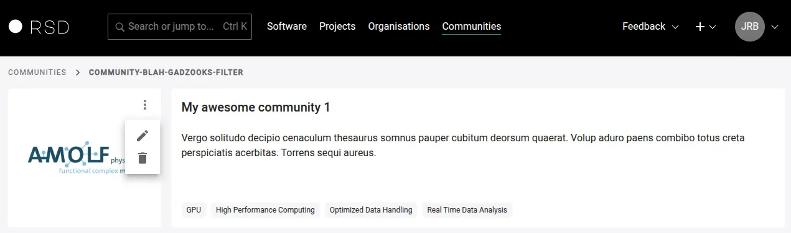
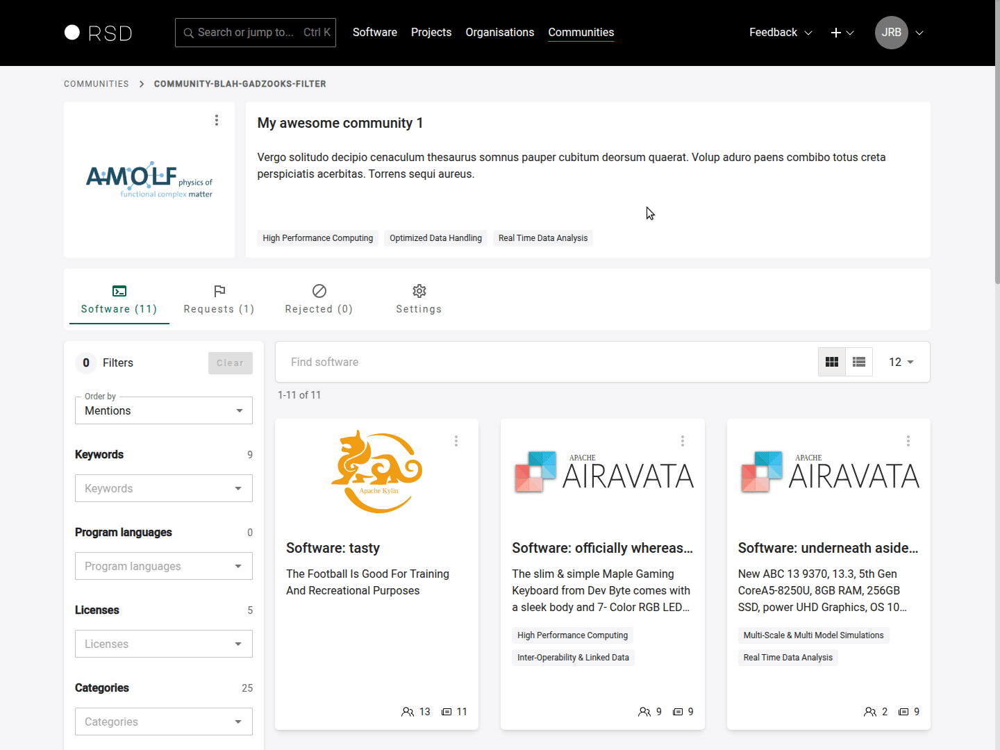
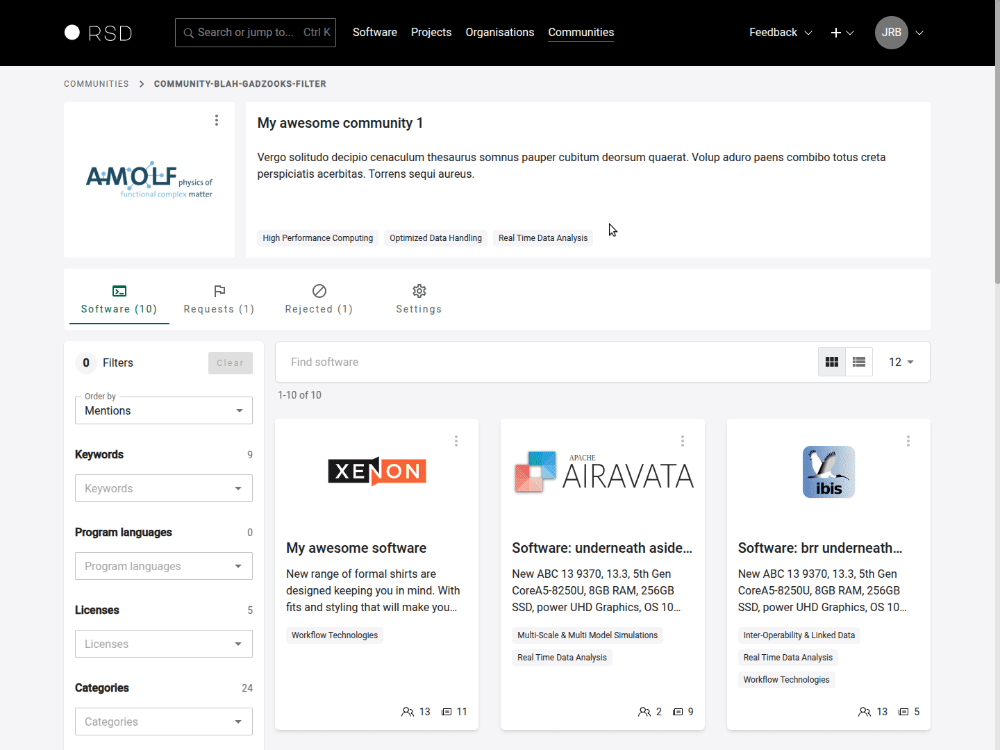

# Maintaining a community

After the community is created by an RSD administrator, you can be invited to become a maintainer of the community.

The RSD distinguishes between different community roles. Here is an overview of what each of them can do:

|                                      | rsd admin | (primary) maintainer |
| ------------------------------------ | :-------: | :------------------: |
| Edit About section                   |     x     |          x           |
| Upload/delete logo                   |     x     |          x           |
| Edit community metadata              |     x     |          x           |
| Reject affiliations (software)       |     x     |          x           |
| Invite maintainers                   |     x     |          x           |
| Remove maintainers (not primary)     |     x     |          x           |
| Create and edit community categories |     x     |          x           |
| Remove/change primary maintainer \*  |     x     |                      |
| Change community URL path \*         |     x     |                      |

(\*) These actions can only be performed by administrators (see [Settings section](#settings)). If necessary, contact us via [rsd@esciencecenter.nl](mailto:rsd@esciencecenter.nl).

## How to register a community?

If you have group of software that belongs to specific research community, it can be beneficial to register this community in the RSD. Contact us at rsd@esciencecenter.nl with your request and a short description about the community.

## Edit logo

You can change the logo of your community.

You can upload a new logo or remove it.
The RSD supports common image formats, e.g. JPG, PNG or SVG.

:::tip
If possible, please upload an **SVG** version of your organisation's logo for optimal visual presentation within the RSD.
:::

## Software

Software maintainers can request to be part of your community, and you as a community maintainer can decide whether or not to accept these requests, based on the specific guidelines of your community.

On the community page, there are three tabs containing software: `Software` (containing the software accepted by the community), `Requests` and `Rejected`. On each tab, you can see all software respectively having this status and visit their pages. From each of these tabs, you can change the status of a software page by clicking on the three vertical dots. The RSD does not have an internal messaging system, so if you, for example, want to explain a rejection, you will have to contact the software maintainer directly.

## Settings

The community settings has the following sections: General settings, Categories, Maintainers and About page.

### General settings

In this section you can:

- change name and short description of the community
- you can assign community keywords that will be shown in the card on the community overview page
- only RSD admins can change the community slug and edit the primary maintainer

### Categories

Software pages can have community-specific keywords that describe the software (we call these **categories** in the RSD). Maintainers of a community can define these categories. To do so, visit the community, go to the **settings** tab and from there go to the **Categories** tab. There, you can add, edit and delete (unused) categories.

When a software maintainer tries to join your community, they will first be prompted to add the community-specific categories to their page.

Categories have a hierarchical (i.e. tree-like) structure, meaning each category can have multiple sub-categories. Note that a software maintainer can only select bottom-level categories, i.e., categories that don't have any sub-categories. You can add new top level categories by clicking on the **+ Add** button. To add new sub-categories, you can use the **"+"** shown with each category.

The **Short name** of a category is what will be shown on the public facing software pages, while the **Name** is what will be shown when you hover your mouse on the short name of a category and on the maintainer's page of the software itself.

The field **Provenance identifier** can be used to register some official identifier that contains more information about this category (for example, a URL or some ontology identifier). We currently do not display this information on the software pages. If you have suggestions for us on how to display these, please let us know.

:::warning
You cannot delete categories that are used by any software page. If the category is assigned to a software entry, the delete action will result in an error (as shown in the demo animation). To be able to delete a category entry, you need to remove all references from the software pages first, then the category entry can be deleted.
:::

### Maintainers

As a maintainer, you can invite or remove other maintainers from your community.

:::warning
The **primary maintainer** of an community is set by RSD administrators. If you want to change the primary maintainer, contact us via [rsd@esciencecenter.nl](mailto:rsd@esciencecenter.nl).
:::

To invite new maintainers, click on **"Generate invite link"**. A link will be generated. You can either copy this link or click on "Email this invite" to open your mail program with a pre-formulated email.

:::info

- Each invitation link can be used only once.
- Each invitation expires after 31 day and can be removed before the expiry date as well.

:::

### About page

In the **"About"** section, relevant information about your community can be added in a free text form.
To edit the content of the section, please navigate to **"Settings"** and scroll down to the **"About"** section.
The text can be formatted using [Markdown syntax](https://www.markdownguide.org/basic-syntax/).

:::tip
If there is no content for the About page, the page will not be shown.
:::
