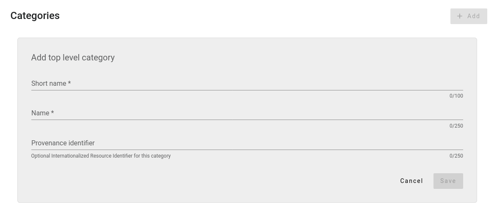

# Maintaining a community

Maintaining a community has a lot of overlap with maintaining an organisation. We therefore refer to the section on [maintaining an organisation](../organisation). The most important differences with organisations will be described below.

## Sub-communities

In contrary to organisations, the RSD does **not** have the concept of a sub-community (called **research units** for organisations), i.e., there is cannot be a parent-child relation between communities.

## Software

Software maintainers can request to be part of your community, and you as a community maintainer can decide whether or not to accept these requests, based on the specific guidelines of your community.

On the community page, there are three tabs containing software: `Software` (containing the software accepted by the community), `Requests` and `Rejected`. On each tab, you can see all software respectively having this status and visit their pages. From each of these tabs, you can change the status of a software page by clicking on the three vertical dots. The RSD does not have an internal messaging system, so if you, for example, want to explain a rejection, you will have to contact the software maintainer directly.

## Categories

Software pages can have community-specific keywords that describe the software (we call these **categories** in the RSD). Maintainers of a community can define these categories. To do so, visit the community, go to the **settings** tab and from there go to the **Categories** tab. There, you can add, edit and delete (unused) categories.

When a software maintainer tries to join your community, they will first be prompted to add the community-specific categories to their page.

Categories have a hierarchical (i.e. tree-like) structure, meaning each category can have multiple sub-categories. Note that a software maintainer can only select bottom-level categories, i.e., categories that don't have any sub-categories. You can add new top level categories by clicking on the **+ Add** button. To add new sub-categories, you can use the **"+"** shown with each category. 

When adding or editing a category, the following form is shown:

The **Short name** of a category is what will be shown on the public facing software pages, while the **Name** is what will be shown when you hover your mouse on the short name of a category and on the maintainer's page of the software itself.

The field **Provenance identifier** can be used to register some official identifier that contains more information about this category (for example, a URL or some ontology identifier). We currently do not display this information on the software pages. If you have suggestions for us on how to display these, please let us know. 
