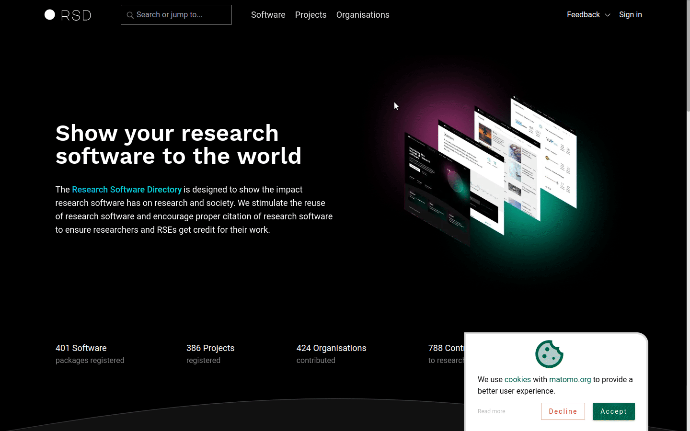

# Cookies

First time you visit RSD website you will be asked to accept the cookies. We use [Matomo](https://matomo.org/) to anonymously measure page views in the RSD. The statistics help us make user centric approach to the feature development.

:::tip
You can change the cookies settings at any time by visiting the "Cookies" page. The link to cookies page is in the footer, see animation below.
:::

