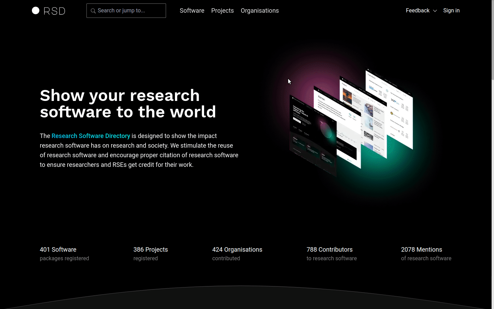

# Getting started

To run your own RSD instance you can use [deployment.zip file provided in the RSD release](https://github.com/research-software-directory/RSD-as-a-service/releases).

:::warning
To be able to use `deployment.zip` file, you need a machine with Docker and Docker compose. In production, you also need a third party authentication service with one or more of the following providers: [Microsoft Entra ID (Azure AD)](/rsd-instance/configurations/#enable-microsoft-entra-id-azure-ad-authentication), [ORCID](/rsd-instance/configurations/#enable-orcid-authentication-and-coupling), [SURFconext](/rsd-instance/configurations/#enable-surfconext-authentication) or [Helmholtz AI](/rsd-instance/configurations/#enable-helmholtz-ai-authentication).
:::

- Unzip `deployment.zip` file. It contains:

  - `.env.example` is an environment example file
  - `CITATION.cff` contains citation information of RSD software.
  - `docker-compose.yml` defines all required RSD services and exposes environment variables used by each service
  - `nginx.conf` basic nginx configuration file.
  - `README.md` contains instructions

- Rename or copy `.env.example` to `.env` and provide the values in the SECRETS section of .env file. Please **do not use special characters** in the `.env` file. For the minimal local setup you should provide values for these variables

```env
POSTGRES_PASSWORD=reallyreallyreallyreallyverysafe
POSTGRES_AUTHENTICATOR_PASSWORD=reallyreallyreallyreallyverysafe
PGRST_JWT_SECRET=reallyreallyreallyreallyverysafe
```

- Start RSD using docker compose

```bash
docker compose up
```

- Visit http://localhost and confirm that the RSD is running

## Login using local account

To be able to log in to RSD you need to enable at least one authentication provider. For testing purposes we offer the local account option. To enable it use `LOCAL` value in `RSD_AUTH_PROVIDERS` property in .env file.

```env
# consumed by services: frontend (api/fe)
# provide a list of supported OpenID auth providers
# the values should be separated by semicolon (;)
# if env value is not provided default provider is set to be SURFCONEXT
# if you add the value "LOCAL", then local accounts are enables, USE THIS FOR TESTING PURPOSES ONLY
RSD_AUTH_PROVIDERS=SURFCONEXT;ORCID;LOCAL
```

:::warning
When changing values of environment variables in .env file you need to restart RSD. Use `docker compose down` followed by `docker compose up -d`
:::

At this point you should be able to see RSD instance running. You should also be able to log in using Local account by providing any username, for example `Tester`. In order to be able to make changes to RSD please accept the Terms of Service and the Privacy Statement after loging in.


:::danger
The local account login option is only for test purposes. Local accounts do not require a password and are therefore not safe.
:::

## Log in as RSD administrator

To be able to log in as RSD administrator, the account id of that account needs to be in the database table `admin_account` first.
To do so, [connect to the database](/rsd-instance/database/#connecting-to-the-database) and execute the following query, changing the value of the UUID:

```sql
INSERT INTO admin_account VALUES ('00000000-0000-0000-0000-000000000000');
```

:::tip
A user can see their account ID in their user settings page, which they can find under the `My settings` option in the profile dropdown menu.
:::

If that user is already logged in, they need to log out and log in again before they can make use of their admin rights.

:::tip
When you log in to the RSD as administrator, you will see an additional "Administration" option in the profile dropdown menu.
:::



## Customizing RSD instance

For customizing and administrating your RSD instance have a look at [configuration](/rsd-instance/configurations/) and [administration](/rsd-instance/administration/).

## Public RSD instance

If you want to run a RSD on a non-localhost machine you will need SSL certificates. The easiest way is to use Linux with Letsencrypt and a public IP address for that purpose.
Please note that you should take measures to protect a public installation against attackers, in particular as long as the authentication has not been set up properly.

You will need git:

```env
sudo apt install git
```

You will also need Docker with the Compose plugin, see the installation instructions for [Docker](https://docs.docker.com/engine/install/) and [Docker Compose](https://docs.docker.com/compose/install/).

You can then clone the RSD:

```env
git clone https://github.com/research-software-directory/RSD-as-a-service.git
```

You can then set your server name in nginx/nginx.conf, let's assume it is `fqdn.yourdomain.com`

```env
server_name fqdn.yourdomain.com;
```

Copy the example config to a .env file

```env
cp .env.example .env
```

and change, as described above, the values for `POSTGRES_PASSWORD`, `PGRST_JWT_SECRET` (with at least 32 characters) and `POSTGRES_AUTHENTICATOR_PASSWORD` to arbitrary values.
Additionally set

```env
POSTGREST_URL_EXTERNAL=http://fqdn.yourdomain.com/api/v1
RSD_AUTH_URL=http://fqdn.yourdomain.com:7000
```

Now start the instance with

```env
docker compose up --detach --scale data-generation=0
```

You can then prepare the SSL certificates for the user cookies

```env
docker compose build --parallel
docker compose exec nginx bash -c 'certbot --nginx -d fqdn.yourdomain.com --agree-tos --register-unsafely-without-email'
```

https://fqdn.yourdomain.com should now show your installation.

To create an admin user, see [these instructions](/documentation/rsd-instance/getting-started/#log-in-as-rsd-administrator).
