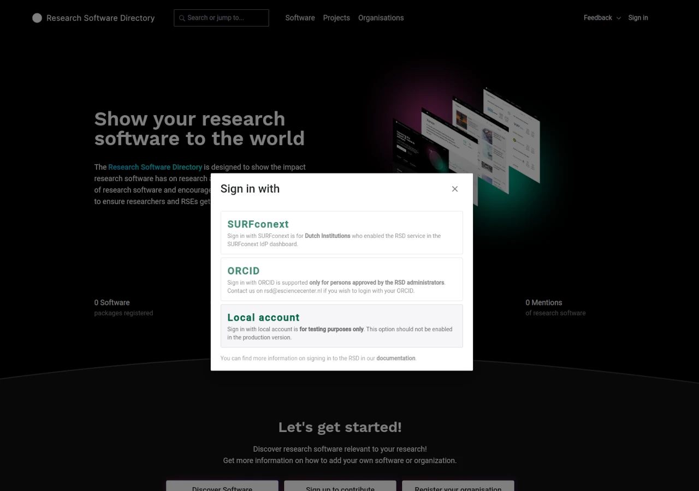

# Getting started

To run your own RSD instance you can use [deployment.zip file provided in the RSD release](https://github.com/research-software-directory/RSD-as-a-service/releases).

:::warning
To be able to use `deployment.zip` file, you need a machine with Docker and Docker compose. In production you also need a third party authentication service with one or more of the following providers: [Microsoft Entra ID (Azure AD)](/rsd-instance/configurations/#enable-microsoft-entra-id-azure-ad-authentication), [ORCID](/rsd-instance/configurations/#enable-orcid-authentication), [SURFconext](/rsd-instance/configurations/#enable-surfconext-authentication) or [Helmholtz AI](/rsd-instance/configurations/#enable-helmholtz-ai-authentication).
:::

- Unzip `deployment.zip` file. It contains:

  - `.env.example` is an environment example file
  - `CITATION.cff` contains citation information of RSD software.
  - `docker-compose.yml` defines all required RSD services and exposes environment variables used by each service
  - `nginx.conf` basic nginx configuration file.
  - `README.md` contains instructions

- Rename or copy `.env.example` to `.env` and provide the values in the SECRETS section of .env file. Please **do not use special characters** in the `.env` file. For the minimal local setup you should provide values for these variables

```env
POSTGRES_PASSWORD=reallyreallyreallyreallyverysafe
POSTGRES_AUTHENTICATOR_PASSWORD=reallyreallyreallyreallyverysafe
PGRST_JWT_SECRET=reallyreallyreallyreallyverysafe
```

- Start RSD using docker compose

```bash
docker compose up
```

- Visit http://localhost and confirm that the RSD is running

At this point you should be able to see RSD instance running. You should also be able to login using Local account by providing any username, for example `Tester`.



:::danger
The local account login option is only for test purposes. Local accounts do not require a password and are therefore not safe.
:::

For customizing and administrating your RSD instance have a look at [configuration](/rsd-instance/configurations/) and [administration](/rsd-instance/administration/).
