# Administration

This section describes administration options available in the RSD.

:::tip
To be able to log in as an RSD administrator, you first need to grant an existing user admin privileges in the database.
See [Log in as rsd administrator in the getting started section](/rsd-instance/getting-started/#log-in-as-rsd-administrator).
:::

## Public pages

Here you can define custom public pages for you RSD instance. The links to custom public pages are shown in the footer of the RSD.

- The title is used as link label
- The slug is used as link
- The content of the page is in Markdown
- The page position can be changed using drag-drop handle (see animation below)


:::tip
You need to activate "Publish" switch and reload the page in order to see changes in the page footer.
:::

## Software highlights

The software overview page design has a highlights section. This section is **shown only when software highlights are set** by an RSD admin.

In addition to the carousel, which is shown on the software overview page, but is not suitable for showing a large number of items, we offer a separate "All Highlights" page. This page can be accessed using the "Browse all Highlights" button, shown underneath the carousel.

:::tip
You can customise the software highlights section in the `settings.json` by changing the values in the optional property `software_highlights`.

- `title` value is shown in the admin section, as carousel title and as a title of all highlights page.
- `limit` defines a maximum number of items to include in the carousel.
- `description` is used on the all highlights page.

```json
{
  "host": {
    "software_highlights": {
      "title": "Software Highlights",
      "limit": 5,
      "description": "Descriptive text below page headline."
    }
  }
}
```

:::


## RSD invites

Here, you can create, view and delete RSD invites. These invites allow users to create an account when using auth providers that require them.

An invite can be configured to have a fixed amount of uses, or to have unlimited uses (by leaving the "How many users" field empty). Existing invites can also be deleted, rendering them useless, which is useful when an invite has leaked out.

Each invite also has an expiration date, after which the invite cannot be used any more.

:::danger

We recommend to use short-lived, single-use invites whenever possible, as these cause the least damage when leaked out.

:::

## RSD users

This section shows all RSD users who logged in to RSD at least once. You can search for users, assign the administrator role (`rsd_admin`) or delete user accounts.

:::danger

- Removing account will remove all its maintainer roles.
- You cannot delete account you are currently using.

:::

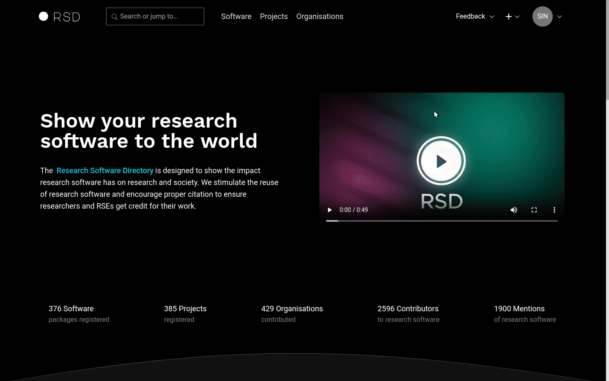

## RSD contributors

The page shows the list of all contributors and team members. You can search by name, email or ORCID. You can change the values in the table by clicking on the value. The values are automatically saved after you navigate out of the edit box. The link in the last column will open the software or project item where this contributor/team member is used.

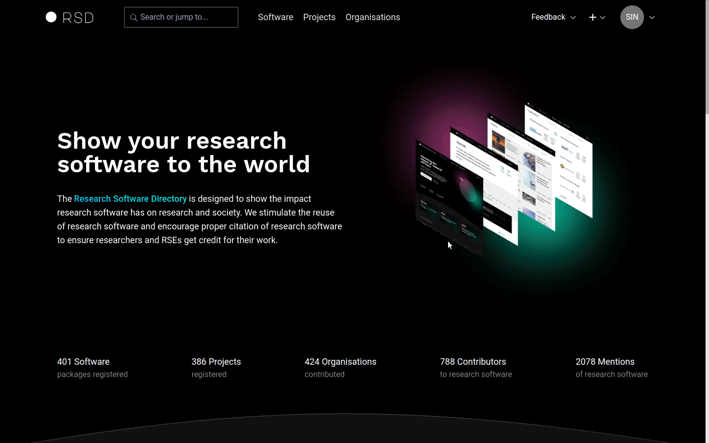

## Software

The page shows list of all software entries, unpublished first. You can search by title or short description. From this overview, you have the option to remove a software entry from the RSD completely, including all related data. In order to prevent accidental deletion, you need to type the software name in the delete modal.

:::danger
The software entry and all related information will be removed from the RSD.
:::

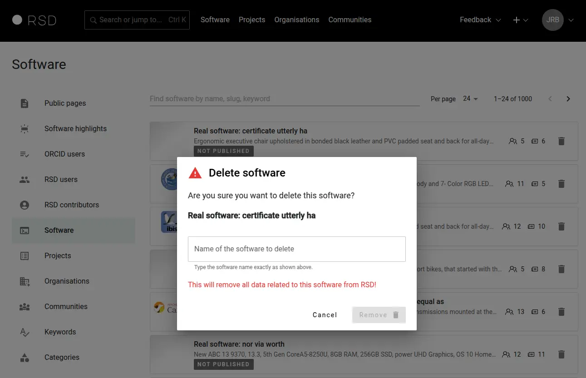

## Projects

The page shows list of all project entries, unpublished first. You can search by title or short description. From this overview, you have the option to remove a project entry from the RSD completely, including all related data. In order to prevent accidental deletion, you need to type project title in the delete modal.

:::danger
The project entry and all related information will be removed from the RSD.
:::

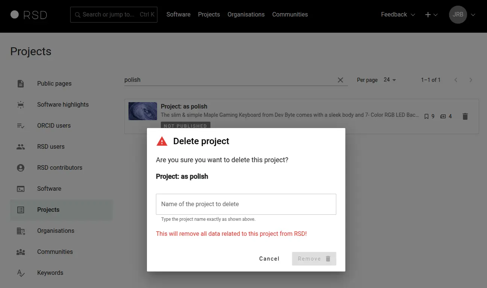

## Organisations

This page allows management of all organisations added to RSD. RSD users can add new organisation on the software or project pages. We use ROR database to retrieve additional information about the organisation.

### Add organisation

Use the search box to find organisations in the ROR database. This is the preferred approach. If the organisation cannot be found in ROR database, you will see the "Add..." option, and you will be able to add basic organisation information manually.

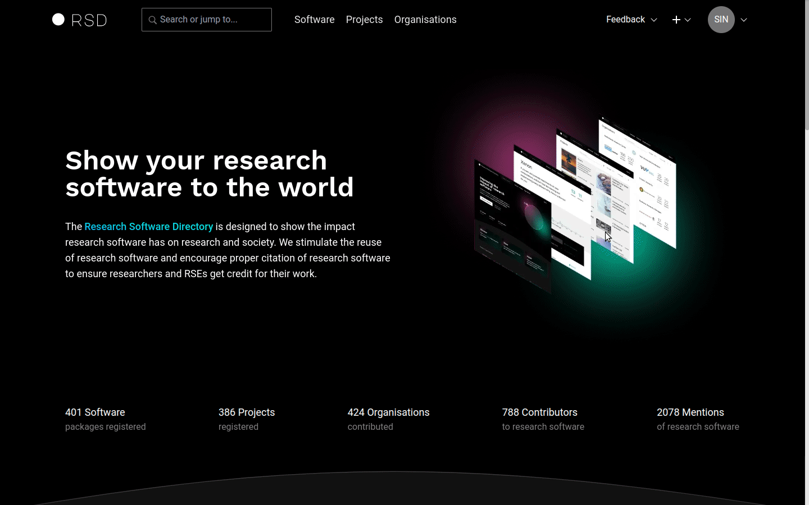

### Define organisation primary maintainer

The primary maintainer of an organisation is defined by an RSD administrator. You need to provide the user ID in the general settings section. The user ID is unique, and it is automatically created by RSD after a user is logged in for the first time.


:::tip
Only the organisation's primary maintainer or RSD administrator can create research units of an organisation.
:::

### Delete organisation

To delete organisation use delete button.

:::warning
The organisation will be permanently removed, including all its references in software and project pages.
:::

### Edit organisation

Administrators can edit all properties of an organisation that organisation maintainers can edit, for these settings please navigate to [maintaining the organisation section](/users/organisation/).

Additionally to organisation maintainers, administrators can edit the following properties of an organisation:

- Official member: whether the organisation is an official organisation.
- RSD path: the `<PATH>` under which the organisation is accessible in the RSD (`/organisations/<PATH>`).
- Primary maintainer: primary maintainer of an organisation.
- Parent organisation: if the organisation belongs to another organisation, add the ID of the parent organisation here. The organisation ID is displayed in the Admin section of the respective organisation.

:::warning
**Note** that changing the parent organisation will also affect the path under which the organisation is accessible. The path is determined by the organisation hierarchy, e.g. `/organisations/parent-organisation/child-organisation`.
:::

The settings are visible in the _Admin section_ under the _General settings_ tab of the organisation settings:

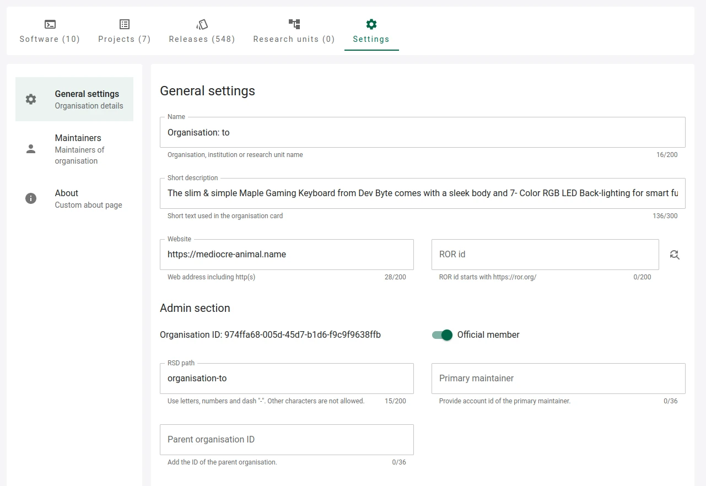

## Communities

Administrators can create and edit all properties of the community. The communities enable grouping of software entries by specific functionality or research discipline. One software entry can be part of multiple communities.

:::tip
Only RSD administrators can create communities.
:::

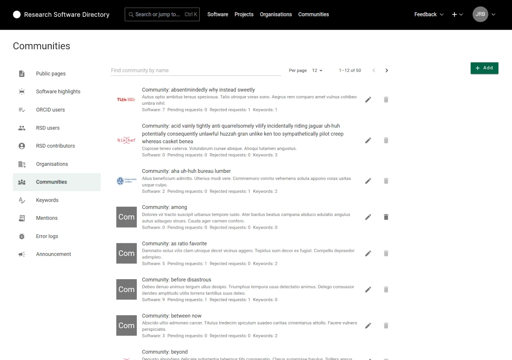

### Add community

To create a new community, use the "Add" button. Provide a name, short description and logo in the modal.

### Edit community

To edit the community settings, click on the community and you will be forwarded to the [community settings page](/users/community/#settings).

### Delete community

Use the "delete" button to delete a community.

:::warning
The community will be permanently removed, including all its references in software items.
:::

## Keywords

RSD comes with a predefined list of keywords. You can change the list by adding new keywords or deleting the existing entries.

:::warning
You can delete the keyword only when it is not used in any software or project.
:::

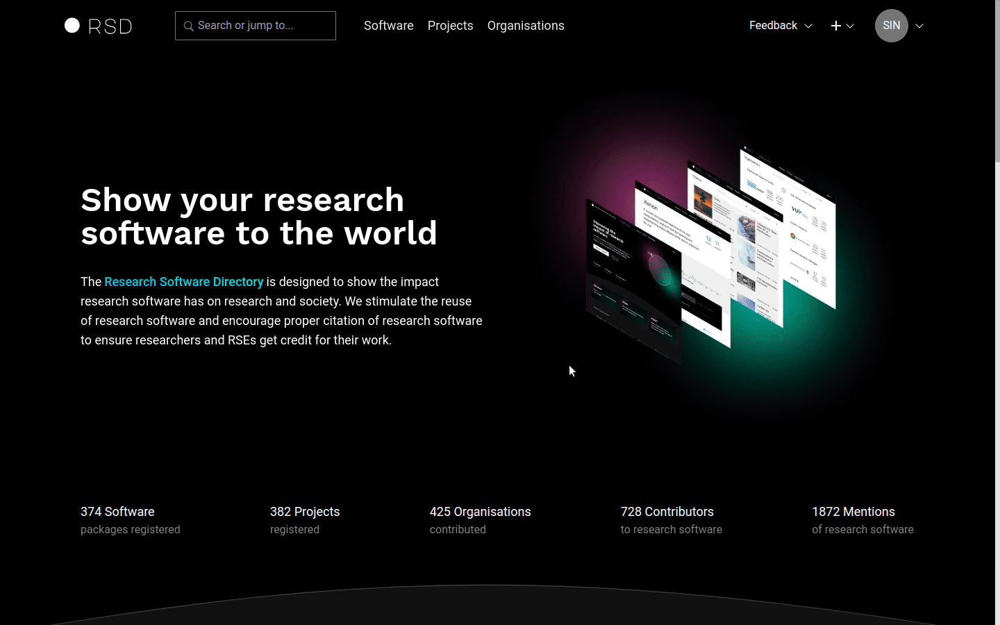

## Categories

Software could be classified by assigning one or more _categories_. Categories are organised in a hierarchical structure (tree).

The following terms are used: A _category_ is a leaf in the category tree. A _parent category_ is a tree node with sub-categories. A _top-level category_ is a tree node with no parent. A list of categories nodes traversing the category tree from a top-level category down to a category is the _category path_ of this category.

Global categories can be managed from the admin page. One can also add categories directly in the database; to get an idea how to populate the `categories` table using SQL statements, see `database/999-add-categories.sql.example`.

Categories of different levels could have different properties. The column `properties` holds a JSON object to flexibly define properties of a category:

- `icon`: optional; see also issue #975. Icons are shown to the end user.
- `is_highlight`: set to `true` to define a highlighted top-level category. These categories are displayed in a separate block on the software page and in a tabular view. With `tree_level_lables: string[]` you could add column headers to this table. For the software maintainer the category headline could have an optional `subtitle` and an optional `description` text will be shown on the right side in the help box.

For supporting category terms from _controlled vocabularies_ (semantic web)
fill the `provenance_iri` column. Further read [Linked Data](https://en.wikipedia.org/wiki/Linked_data) and [SKOS](http://www.w3.org/TR/skos-reference).

## Mentions

In this section, admins can search for mentions and edit them. If you enter a DOI or UUID, we search on that field only. Otherwise, we search on title, authors, journal, URL, note and OpenAlex ID.

:::warning
Edit mentions with care: they might be referenced to in multiple places. If you want to fully change a mention attached to e.g. a software page, you should delete it there and create a new one instead of editing it.
:::

## RSD info

Here you can define information about your RSD instance that you want to communicate to other RSD instances or other "third party services". The information is available at the endpoint /api/v1/rsd_info

The core RSD service uses the following information from this section:

- `remote_name`: This is the name of your RSD instance. It is used by other RSD instances to identify software from your RSD. It is also used by your RSD instance when you make use of [Remotes](#remotes).

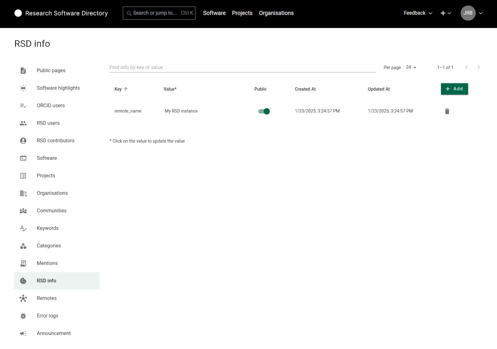

## Remotes

Here you can connect your RSD to remote RSD instances. These connections will be used to "enrich" your RSD instance with additional (remote) software entries.

:::tip
When connecting to remote RSD instances, each software card in the software overview shows the source RSD. The software from your "local" RSD uses the `remote_name` property defined in the [RSD Info section](#rsd-info).
:::

For each remote RSD you wish to connect to, you need to provide the URL to the homepage of that RSD instance. If the RSD remote is of version 3 or higher the instance will return an RSD instance name suggested by the instance owner. For the earlier RSD versions, you need to provide a remote name/label manually.

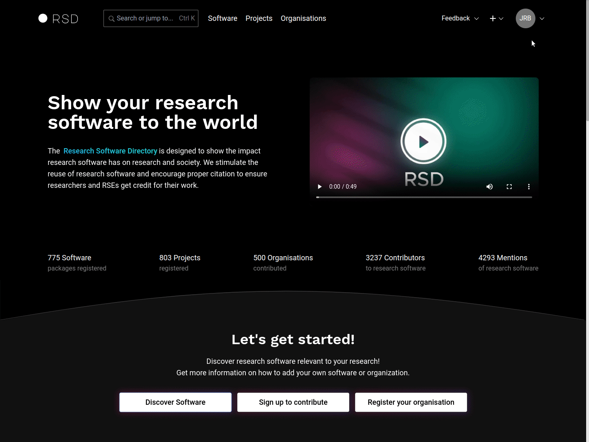

:::tip
For clarity, it is advised to use suggested RSD instance name configured by the instance owner. This ensures instance names across the RSD network remain the same.
:::

## Error logs

This section shows any errors originating from the background processes like data scrapers. Provided information should be understandable to rsd administrators in the most cases. The error object contains error response. The stacktrace is convenient for the programmers. The link will navigate you to the software or the project that triggers the error.


## Announcement

This section is used to show public announcements to all users of the RSD. It is generally meant to announce the RSD maintenance moment.

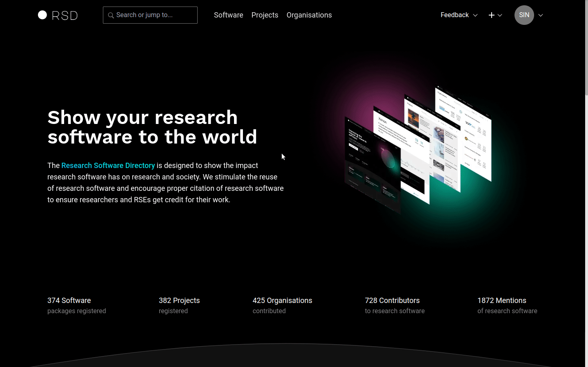

## Software

### Software Slug

When editing a software page, the **slug** of the page (called **RSD path**) can be changed by admins under the **Description** tab.

### Disable Git harvesting

If you want to disable the harvesting of a Git repo, you can do so by providing a reason under the **Links & metadata** tab. Page maintainers will be able to see if and why the harvesting is disabled under the **Background services** tab.

### Disable package manager harvesting

If you want to disable the harvesting of a package manager, you can do so by providing a reason under the **Package managers** tab. Page maintainers will be able to see if and why the harvesting is disabled under the **Background services** tab.

## Project

### Project Slug

When editing a project page, the **slug** of the page (called **RSD path**) can be changed by admins under the **Project details** tab.

## News

RSD administrators are able to create news items. The additional option "Add news" will appear in the "+" menu at the top right of the page header.

### Add news item

Using the "Add news" option in the "+" menu will open add news item page where you can provide the publication date and title.

:::info

- The news item url (slug) is generated using publication date and title.
- In case the slug is already taken the warning will appear below the url. You can manually change the url part created from the title or change the publication date if possible.

:::

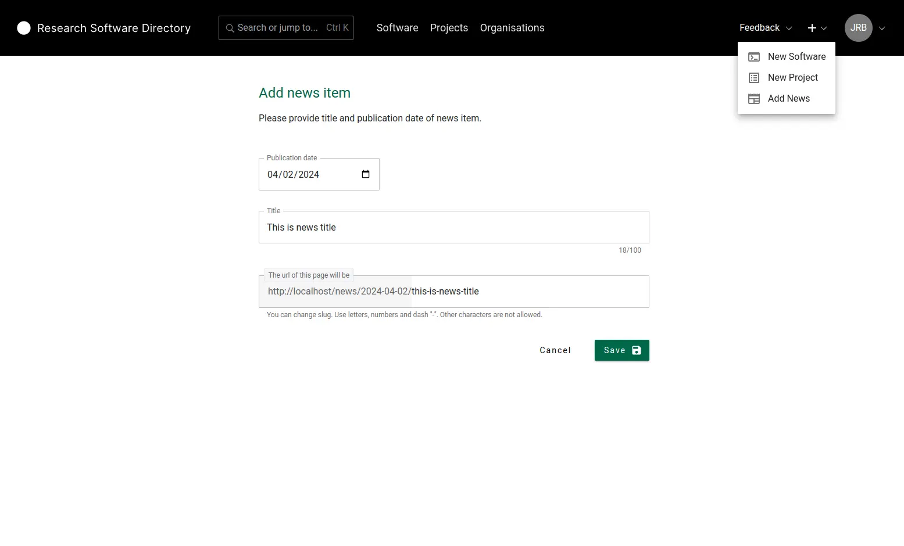

### Edit news item

After news item is created you will be redirected to edit news item page. Here you can add the summary and the body of the news item. You can import the images you want to use in the news article. When you are satisfied with the news item content use switch "Published" to publish the article.

:::info

- Summary is used in the latest news section of the homepage and in the news card on the news overview.
- Publication date is shown in the header of the news title. It can be changed at any time. Note that changing the publication title also changes public url of the news item.
- First uploaded image is used in the news card.
- Using "Copy link" button you can copy the Markdown syntax to the clipboard and the paste the link at the desired location of the body.
- Using "Delete" button will delete the image and the Markdown link syntax from the news body.

:::

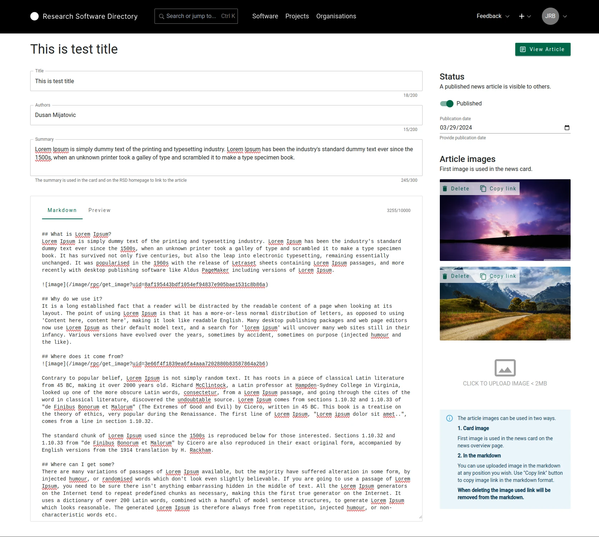

### Latest news

The latest news selection is shown on the homepage after "Our Goals" section. It consists of the 3 most recent items, based on the publication date, and "More news" button that links to the news overview page.

:::warning
If there are no published news items the "Latest news" section is omitted from the homepage.
:::

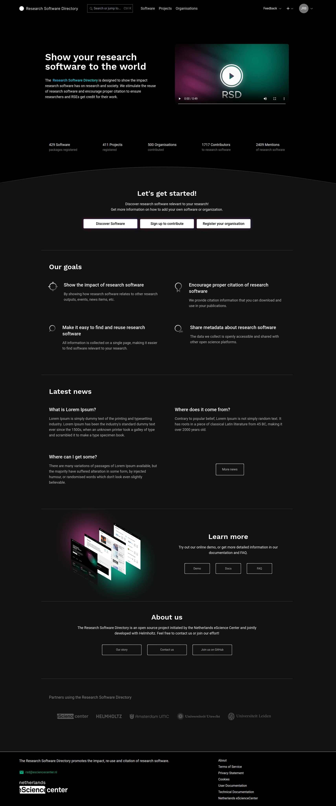
