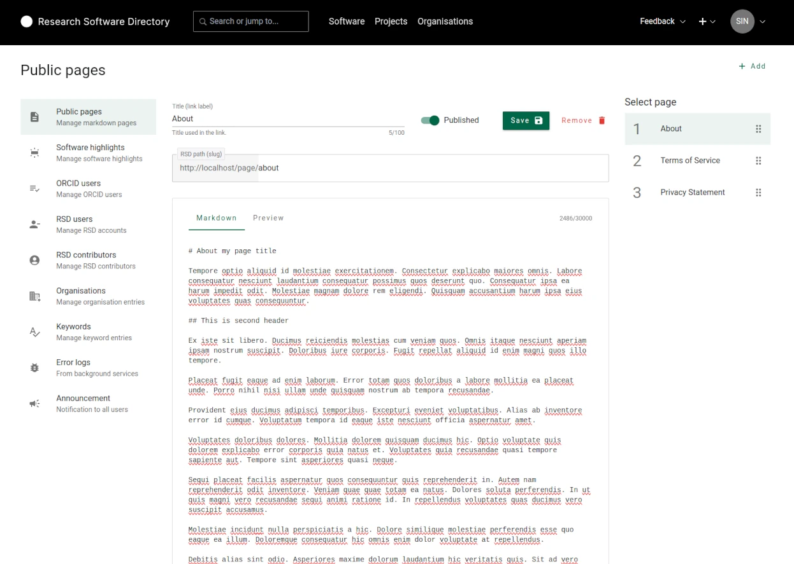
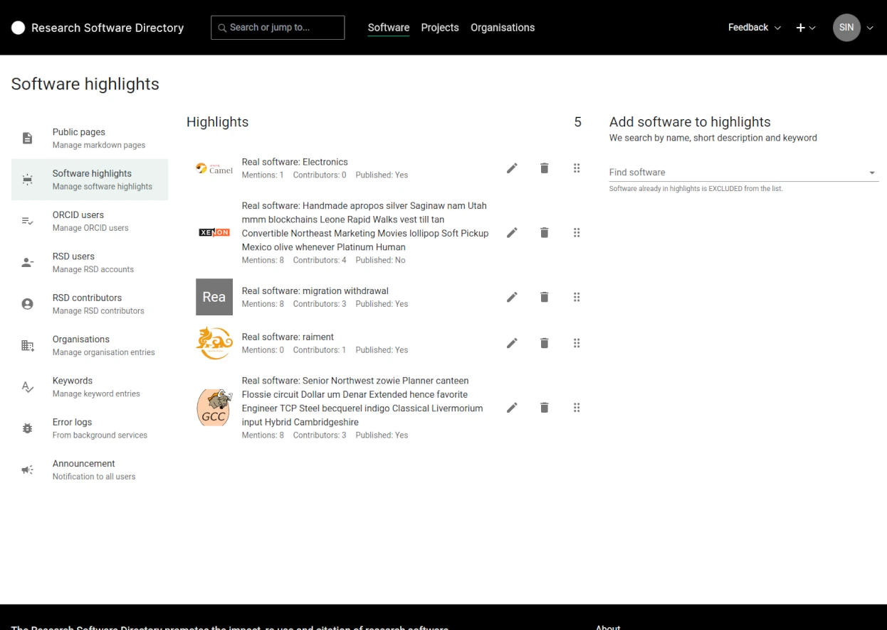

# Administration

The administration of RSD instance.

## Public pages

Here you can define custom public pages for you RSD instance. The links are shown in the footer of the RSD.

- The title is the used as link label
- The slug is used as link
- The content of the page is in markdown

## Software highlights

The software overview page design has an highlights section. This section is shown when the software hightlights are defined by RSD admin.

:::tip
You can customize software highlights section title using settings.json by providing the value in the optional property ``
:::

## ORCID users

In this section we define ORCID id's allowed to login to RSD.

:::warning
In order to use this functionality [ORCID authentication provider need to be enabled](/rsd-instance/configurations/#enable-orcid-authentication).
:::
