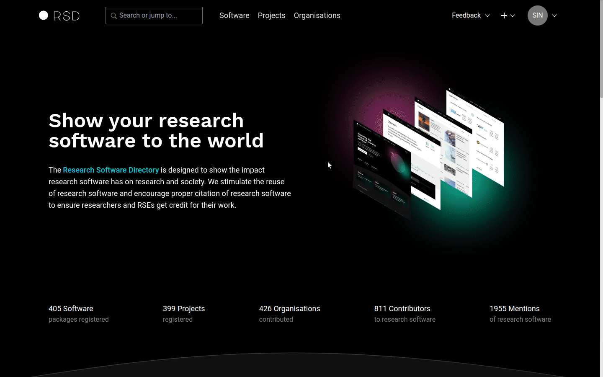

# Administration

This section describes administration options available in the RSD.

:::tip
To be able to log in as RSD administrator you first need to define a list of rsd admin users in the .env file.
See [Login as rsd administrator in the getting started section](/rsd-instance/getting-started/#login-as-rsd-adminstrator).
:::

## Public pages

Here you can define custom public pages for you RSD instance. The links to custom public pages are shown in the footer of the RSD.

- The title is used as link label
- The slug is used as link
- The content of the page is in Markdown
- The page position can be changed using drag-drop handle (see animation below)


:::tip
You need to activate "Publish" switch and reload the page in order to see changes in the page footer.
:::

## Software highlights

The software overview page design has a highlights section. This section is **shown only when software highlights are set** by an RSD admin.

In addition to the carousel, which is shown on the software overview page, but is not suitable for showing a large number of items, we offer a separate "All Highlights" page. This page can be accessed using the "Browse all Highlights" button, shown underneath the carousel.

:::tip
You can customise the software highlights section in the `settings.json` by changing the values in the optional property `software_highlights`.

- `title` value is shown in the admin section, as carousel title and as a title of all highlights page.
- `limit` defines a maximum number of items to include in the carousel.
- `description` is used on the all highlights page.

```json
{
  "host": {
    "software_highlights": {
      "title": "Software Highlights",
      "limit": 5,
      "description": "Descriptive text below page headline."
    }
  }
}
```

:::


## ORCID users

This section shows the list of ORCIDs that are allowed to log in to the RSD. Because anyone can create an ORCID account, we decided to limit access only to ORCID users that are approved by an RSD administrator.

:::warning
In order to be able to log in with ORCID credentials, the [ORCID authentication provider needs to be enabled](/rsd-instance/configurations/#enable-orcid-authentication) and the ORCID of that user need to be added to this list.
:::

You can add, search and delete ORCIDs from the RSD. Use the bulk import button to add up to 50 ORCID users to the RSD at once.



## RSD users

This section shows all RSD users who logged in to RSD at least once. You can search for users, assign the administrator role (rsd_admin) or delete user accounts.

:::danger

- Removing account will remove all its maintainer roles.
- You cannot delete account you are currently using.
  :::


## RSD contributors

The page shows the list of all contributors and team members. You can search by name, email or ORCID. You can change the values in the table by clicking on the value. The values are automatically saved after you navigate out of the edit box. The link in the last column will open the software or project item where this contributor/team member is used.


## Organisations

This page allows management of all organisations added to RSD. RSD users can add new organisation on the software or project pages. We use ROR database to retrieve additional information about the organisation.

### Add organisation

Use the search box to find organisations in the ROR database. This is the preferred approach. If the organisation cannot be found in ROR database, you will see the "Add..." option, and you will be able to add basic organisation information manually.


### Define organisation primary maintainer

The primary maintainer of an organisation is defined by an RSD administrator. You need to provide the user id in the general settings section. The user id is unique, and it is automatically created by RSD after a user is logged in for the first time.


:::tip
Only the organisation's primary maintainer or RSD administrator can create research units of an organisation.
:::

### Delete organisation

To delete organisation use delete button.

:::warning
You can delete organisation only if there are no software and project items associated with it.
:::

### Edit organisation

For editing the organisation see [maintaining the organisation section](/users/organisation/).

## Keywords

RSD comes with a predefined list of keywords. You can change the list by adding new keywords or deleting the existing entries.

:::warning
You can delete the keyword only when it is not used in any software or project.
:::


## Error logs

This section shows any errors originating from the background processes like data scrapers. Provided information should be understandable to rsd administrators in the most cases. The error object contains error response. The stacktrace is convenient for the programmers. The link will navigate you to the software or the project that triggers the error.


## Announcement

This section is used to show public announcements to all users of the RSD. It is generally meant to announce the RSD maintenance moment.


## News

RSD administrators are able to create news items. The additional option "Add news" will appear in the "+" menu at the top right of the page header.

### Add news item

Using the "Add news" option in the "+" menu will open add news item page where you can provide the publication date and title.

:::info

- The news item url (slug) is generated using publication date and title.
- In case the slug is already taken the warning will appear below the url. You can manually change the url part created from the title or change the publication date if possible.

:::


### Edit news item

After news item is created you will be redirected to edit news item page. Here you can add the summary and the body of the news item. You can import the images you want to use in the news article. When you are satisfied with the news item content use switch "Published" to publish the article.

:::info

- Summary is used in the latest news section of the homepage and in the news card on the news overview.
- Publication date is shown in the header of the news title. It can be changed at any time. Note that changing the publication title also changes public url of the news item.
- First uploaded image is used in the news card.
- Using "Copy link" button you can copy the Markdown syntax to the clipboard and the paste the link at the desired location of the body.
- Using "Delete" button will delete image and the Markdown link syntax from the news body.

:::


### Latest news

The latest news selection is shown on the homepage after "Our Goals" section. It consists of the 3 most recent items, based on the publication date, and "More news" button that links to the news overview page.

:::warning
If there are no published news items the "Latest news" section is omitted from the homepage.
:::


