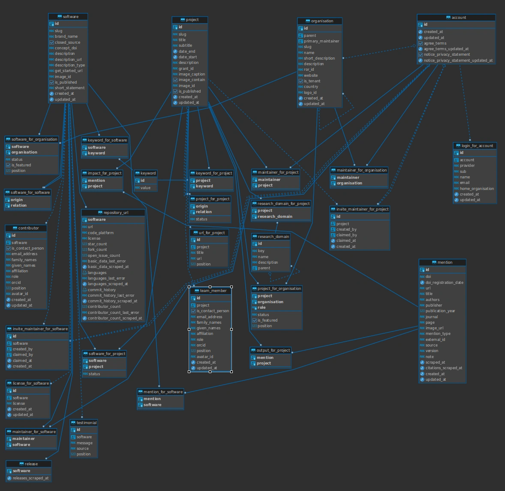

# Database

This section contains various topics on the RSD database.

## Database structure



The SQL scripts used to [create tables, relations, RLS and RPC's are in the database folder of our repo](https://github.com/research-software-directory/RSD-as-a-service/tree/main/database).

## Connecting to the database

In some cases, it can be useful to connect to the database directly, so you can query it.
To do so, first connect to the VM on which your RSD instance lives and go to the directory containing the `docker-compose.yml` file.
Then run the command

```shell
docker compose exec database bash
```

to enter the database Docker container.
Then run

```shell
psql --dbname=rsd-db --username=rsd
```

where you should replace the values if you set them differently in your `.env`.
You can now run arbitrary SQL queries as root user.

## Database migration scripts

We [publish database migration script during the release](https://github.com/research-software-directory/RSD-as-a-service/releases). The migration script can be used to upgrade the database structure from the previous version to released version. We use the published database migration script to update out production RSD instance.

All [migration scripts are stored in our production repository](https://github.com/research-software-directory/RSD-production/tree/main/database-migration).

## Scheduling repeated tasks

We recommend to use [`cron`](https://en.wikipedia.org/wiki/Cron) to schedule repeated tasks, like [Routine Database Maintenance Tasks](https://www.postgresql.org/docs/current/maintenance.html). You can use [crontab guru](https://crontab.guru/) to assist with making and understanding crontab entries.

As an example, to clean up maintainer invites older than a year, you could add the following entries to your crontab (making sure to replace values where applicable, e.g. the file location):

```
30 1 * * * docker-compose --file /home/ubuntu/docker-compose.yml exec -T database psql --dbname=rsd-db --username=rsd --command="DELETE FROM invite_maintainer_for_software WHERE created_at < CURRENT_TIMESTAMP - INTERVAL '1 year';"
30 2 * * * docker-compose --file /home/ubuntu/docker-compose.yml exec -T database psql --dbname=rsd-db --username=rsd --command="DELETE FROM invite_maintainer_for_project WHERE created_at < CURRENT_TIMESTAMP - INTERVAL '1 year';"
30 3 * * * docker-compose --file /home/ubuntu/docker-compose.yml exec -T database psql --dbname=rsd-db --username=rsd --command="DELETE FROM invite_maintainer_for_organisation WHERE created_at < CURRENT_TIMESTAMP - INTERVAL '1 year';"
```

You can append `>> /home/ubuntu/cron.log 2>&1` to a line to write all output and error messages to a text file.

As an alternative to `cron`, you could use [pg_cron](https://github.com/citusdata/pg_cron) instead. This will require some more work to install it, set it up and keeping it up to date.
