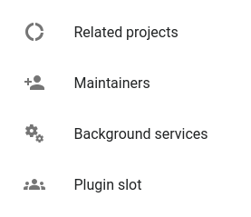

<!--
SPDX-FileCopyrightText: 2024 Christian Meeßen (GFZ) <christian.meessen@gfz-potsdam.de>
SPDX-FileCopyrightText: 2024 Helmholtz Centre Potsdam - GFZ German Research Centre for Geosciences

SPDX-License-Identifier: CC-BY-4.0
-->

# Plugin Development

The RSD offers limited support for plugins, meaning that third party services can add provide links in dedicated slots (plugin slots) within the user interface.

A simple example is available in [research-software-directory/RSD-plugin-example](https://github.com/research-software-directory/RSD-plugin-example).

## Available plugin slots

Plugin slots are currently available in the user menu:


and at the bottom of the software edit navbar:



## How plugins work

1) User needs logs in.
2) Next.js performs GET requests to all registered plugins, to the endpoint `http://localhost/plugin/<plugin>/api/config`. The user token is sent in the header for authentication. The token contains a `data` attribute which can be used to determine which links should be displayed for each user. Users logged in via HelmholtzID have their [`eduPersonEntitlements`](https://hifis.net/doc/helmholtz-aai/attributes/#group-membership-information) delivered within the `data` attribute.
3) If necessary, the plugin backend verifies the user token.
4) The plugin backend returns a list of `PluginSlot` that need to be in the following format:
   ```typescript
   type PluginSlot={
     slot: PluginSlot,
     icon: string,
     href: string,
     title: string,
     subtitle: string | null
   }
   ```
   where `PluginSlotNames` is:
   ```typescript
   type PluginSlot = 'userMenu' | 'editSoftwareNav'
   ```
5) The plugin slots are stored in the global `<RsdPluginContext>` within the next app and can be accessed by the components.

## Developing plugins

If the plugin requires a database, it can either use a new scheme in the existing database container, or provide its own.

If the plugin provides its own database and user authentication is required, the plugin backend needs access to the `PGRST_JWT_SECRET` so that it can verify the user token.

The backend of the plugin needs to be added to the reverse proxy configuration. It must be available via `/modules/<plugin>` where 
